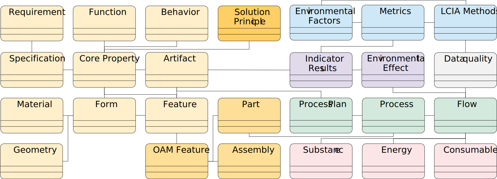
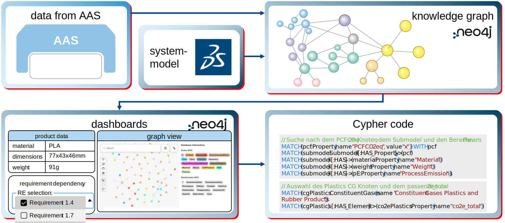
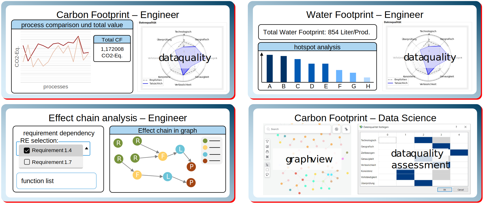

# Sustainability Data Integration KIT (SDI-KIT)
https://eclipse-tractusx.github.io/documentation/kit-framework/#kit-template 


---

## Table of Contents

- [Adoption View](#adoption-view)
  - [Introduction](#introduction)
  - [Vision](#vision)
  - [Mission](#mission)
  - [Synergies and Positioning within the Tractus-X Ecosystem](#synergies-and-positioning-within-the-tractus-x-ecosystem)
  - [Business Value](#business-value)
  - [Use Case / Domain Explanation](#use-case--domain-explanation)
    - [Today's Challenge](#todays-challenge)
    - [Use Cases](#use-cases)
    - [Regulatory Relevance](#regulatory-relevance)
    - [Value Chain Partners](#value-chain-partners)
  - [Whitepaper](#whitepaper)
  - [Standards](#standards)
- [Development View](#development-view)
  - [Architecture View](#architecture-view)
  - [Sequence View](#sequence-view)
  - [API Documentation](#api-documentation)
  - [Sample Data: TRACEpen](#sample-data-tracepen)
  - [Demonstrator Implementation in the Laboratory](#demonstrator-implementation-in-the-laboratory)
  - [The AAS Data Model, Submodels and Custom Submodels](#the-aas-data-model-submodels-and-custom-submodels)
- [Documentation](#documentation)
  - [Copyright Notice](#copyright-notice)
  - [Changelog](#changelog)
  - [NOTICE](#notice)
  - [References](#references)

# Adoption View

## Introduction

The **Sustainability Data Integration KIT (SDI-KIT)** provides a structured, interoperable approach to acquire, process, and operationalize sustainability-relevant data from established engineering systems. Using existing PLM systems as the central, reliable data foundation, the KIT progressively enriches this baseline with simulation, ERP, and OPC UA-connected production data across the entire product lifecycle.

The KIT is purpose-built for the Manufacturing-X dataspace and enables sovereign, cross-company exchange of product, process, and environmental data via standardized Asset Administration Shell (AAS) submodels and Eclipse Dataspace Connector (EDC)-based data sharing. It positions itself upstream of downstream use cases such as Digital Product Passports (DPP) and PCF exchange, by providing the primary sustainability data those use cases depend on.

**The SDI-KIT aims to:**
- use PLM master data as the reliable starting point for early-stage LCA,
- successively enrich this baseline with simulation results (e.g. EMA), order-specific ERP data, and OPC UA-based production measurements,
- enable flexible, method-agnostic calculation of sustainability indicators via OpenLCA API integration,
- store and version LCA inputs and results in a standardized AAS-based format, preserving source attribution across all data quality levels,
- support interoperable, sovereign data exchange within the Manufacturing-X dataspace via EDC connectors.

## Vision

**Integrating sustainability into product engineering — flexible, PLM-based assessment enriched by engineering and production data.**

PLM data forms the basis for the engineering of technical products. To enable flexible and robust assessments and decision making, data from the supply chain and the product lifecycle must be systematically consolidated to effectively support engineering decisions. The Sustainability Data Integration KIT documents use cases for the successive integration of simulation, ERP, and production data, flexible in choice of system, impact, and method, available at the point of engineering decisions.

## Mission

The SDI-KIT is provided to improve the reliability of sustainability assessments during product engineering. Early lifecycle assessments often rely on generic secondary data, although major environmental impacts are already influenced by engineering decisions at this stage.

The KIT addresses this gap by enabling a stepwise enrichment of sustainability-relevant data. It starts with PLM-based product master data and progressively integrates simulation results, ERP information, production measurements, and supplier-provided datasets.

All inputs, calculation results, metadata, and source information are stored in an AAS-based structure. This allows organizations to compare different data-quality levels, trace the origin of sustainability values, recalculate environmental indicators when better data becomes available, and share selected datasets sovereignly through the dataspace.

The SDI-KIT builds on Tractus-X standards and technical building blocks and specifically focuses on integrating, contextualizing and preparing sustainability-relevant product, process and operational data for environmental assessment and decision support [1].

## Synergies and Positioning within the Tractus-X Ecosystem

Like other KITs in the Tractus-X library, the **Sustainability Data Integration KIT** builds on established Tractus-X standards, interoperability mechanisms and technical building blocks. Its specific role is the integration, contextualization and preparation of sustainability-relevant product, process and operational data for environmental assessment and decision support. In contrast to downstream exchange or reporting KITs, the SDI-KIT focuses on the upstream creation of assessment-ready sustainability information from heterogeneous enterprise systems such as PLM, ERP, simulation environments and OPC UA-connected production systems. It therefore complements existing KITs by connecting engineering and production data with AAS-based sustainability data structures and method-agnostic LCA calculation workflows.

The **Digital Twin KIT** provides the primary technical foundation for the SDI-KIT. It defines the Tractus-X approach for standardized digital twins, including discovery, registry and submodel-based data access. This directly matches the SDI-KIT architecture, in which sustainability-relevant data is stored and versioned in AAS submodels and made available through AAS-compliant services. The SDI-KIT relies on this infrastructure to expose and consume data from PLM, ERP, simulation and shop-floor sources in an interoperable and sovereign manner. The distinction in scope is clear: the Digital Twin KIT defines how twins, registries and interfaces are structured and accessed, while the SDI-KIT is responsible for ingesting, harmonizing and enriching the underlying source data and linking it to LCA-relevant semantics and calculation results.

The **Product Carbon Footprint Exchange KIT (PCF-KIT)** is the closest downstream counterpart of the SDI-KIT. Its focus is the standardized exchange of already prepared PCF information between business partners based on agreed semantic models, interfaces and governance rules. The SDI-KIT operates upstream of this exchange by preparing the primary data, assumptions and calculation inputs needed to derive robust environmental indicators. This includes not only carbon-related values but also broader sustainability information generated from PLM structures, simulation outputs, ERP data and production measurements. In this sense, the SDI-KIT can provide validated and traceable sustainability outputs that may later be exchanged through the PCF Exchange KIT, while the latter does not address data integration, multi-source enrichment or iterative LCA preparation.

The **EcoPass KIT** represents an important downstream integration point. It provides the framework for digital product passports based on Tractus-X concepts such as AAS, SSI, decentralized registries and sovereign data exchange. The SDI-KIT can serve as an upstream provider of sustainability-related content for such passports, especially where environmental footprint, product-related compliance data or lifecycle-related sustainability evidence is required. This relationship is consistent with the SDI-KIT mission: sustainability information is first collected, enriched, stored and versioned in AAS-based structures and can then be selectively shared into downstream passport scenarios. The EcoPass KIT focuses on the structured provision and consumption of passport information, whereas the SDI-KIT focuses on generating and contextualizing the sustainability data that may populate such passport structures.

The **Modular Production KIT** is relevant where sustainability assessments depend on operational production data. It standardizes the exchange of shop-floor and production-related information, including planning, tracking and execution data. This creates a structured interoperability layer for production-related primary data, which the SDI-KIT can use to improve the quality and granularity of environmental assessments. This is closely aligned with the SDI-KIT use cases, where OPC UA-connected production systems provide measured energy, cycle-time and timestamp data that is aggregated and stored in dedicated AAS submodels. The boundary remains distinct: the Modular Production KIT standardizes operational production-data exchange, whereas the SDI-KIT interprets and transforms such data into sustainability-relevant information and environmental indicators.

The **Manufacturing as a Service KIT** is not a direct dependency of the SDI-KIT, but an adjacent KIT with complementary potential. Its purpose is the standardized publication, discovery and matching of manufacturing capabilities and quotation requests within distributed manufacturing networks. Where alternative suppliers, processes or manufacturing setups are considered, the SDI-KIT can contribute comparative sustainability assessments based on integrated lifecycle and production data. However, the SDI-KIT does not perform capability matchmaking, quotation orchestration or network-based manufacturing allocation. Its role is limited to the sustainability-oriented interpretation of such alternatives.

The **Geometry KIT** is a complementary engineering-data KIT. It standardizes the exchange of geometry and CAD-related information for secure cross-company engineering collaboration. This is relevant to the SDI-KIT because product master data from PLM systems may include geometry-derived properties such as mass, material allocation or 3D-related product structure information that influence environmental modelling. In the SDI-KIT architecture, such information forms part of the early-stage product baseline used for initial LCA calculations. The Geometry KIT therefore contributes engineering context, while the SDI-KIT uses this context for sustainability interpretation and comparison.

Further adjacent KITs, such as the **Industry Core KIT**, **Traceability KIT**, **Circularity KIT** and **Requirements KIT**, share parts of the broader engineering and lifecycle context but do not overlap with the main purpose of the SDI-KIT. Industry Core and Traceability focus on standardized product identities, part structures and lifecycle relations; Circularity focuses on end-of-life and circular-economy use cases; and Requirements addresses the exchange of engineering requirements. The SDI-KIT can reuse selected structures or identifiers from these contexts, but its distinct contribution remains the transformation of heterogeneous source data into harmonized, source-attributed and assessment-ready sustainability information.

Overall, the SDI-KIT is positioned as a cross-cutting sustainability integration layer within the Tractus-X ecosystem. It reuses shared digital twin and dataspace infrastructure, consumes standardized data from adjacent KITs and enterprise systems, and provides sustainability-oriented outputs to downstream exchange and passport scenarios. Its distinguishing role is the stepwise enrichment of sustainability data across the product lifecycle, from early PLM-based estimations to simulation-, ERP- and production-data-enriched assessments, while preserving traceability, source attribution and recalculability in AAS-based structures.

*Overview used Services in the SDI-KIT*
| Service Name | Description | Reference Implementation | Standardized in |
| --- | --- | --- | --- |
| Digital Twin Registry | An exhaustive list of all Submodel Servers, with link to their assets, adhering to the AAS Registry API. Responsible for having the Digital Twins of the provider and indicating the endpoints to the Passport Aspects. |  | CX-0002 |
| Submodel Server | The data source adhering to a subset of the Submodel API as defined in AAS Part-2 3.0, where the Passport Aspects are stored. | Eclipse BaSyx | CX-0002 / Digital Twin KIT |
| EDC | Main gateway to the network. In this use case, two EDCs need to exist: one connected to the Digital Product Pass (EcoPass KIT) as EDC Consumer, and another connected to the provider Catena-X components as EDC Provider. | Tractus-X EDC, provided by Smart Systems Hub | CX-0018 |
| PLM/ERP Integration | Connection to internal enterprise systems for managing part types, part instances, data chains, and links between twins. | Part Type, Part Instance, Data Chains, Linking of Twins | Industry Core KIT |


## Business Value

The SDI-KIT creates business value by enabling solution providers and adopters to transform heterogeneous engineering, simulation, ERP, production and supplier data into structured, interoperable and source-attributed sustainability information. Rather than prescribing a fixed toolchain or a single assessment method, the KIT provides reusable integration patterns for building sustainability data pipelines that can be adapted to different industrial environments and business models. In this way, the SDI-KIT supports the implementation of commercial and non-profit solutions in the Tractus-X and Manufacturing-X ecosystem that depend on reliable, shareable and assessment-ready sustainability data.

### **Improved sustainability data quality through system integration**
The SDI-KIT enables the direct integration of data from existing enterprise and shop-floor systems, including PLM product structures, ERP bills of materials, simulation outputs and OPC UA-based production measurements. This allows generic secondary data to be progressively replaced by more context-specific engineering and operational data whenever available. As a result, sustainability assessments become more reliable, better traceable and more useful for engineering and sourcing decisions.

### **Flexible and method-agnostic sustainability assessment**
The SDI-KIT supports modular integration workflows that connect heterogeneous source systems with sustainability calculation services through standardized APIs. Environmental indicators can therefore be calculated, recalculated and compared whenever product, process or supplier data changes. This gives solution providers and adopters the flexibility to integrate different tools, methods and impact categories without being locked into one specific assessment approach.
### **Progressive data quality enrichment across product lifecycle**
The SDI-KIT supports the stepwise enrichment of sustainability information from early engineering estimates to simulation-based, ERP-supported and production-data-enriched assessments. Instead of replacing previous results, new data-quality levels can coexist with earlier estimates in a traceable and versionable way. This makes it possible to compare assumptions, document data provenance and improve sustainability results over time as more specific lifecycle data becomes available.

### **Reduced integration effort and scalable solution design**
The SDI-KIT reduces the manual effort typically required to prepare and maintain sustainability data by providing reusable architectural patterns for automated data acquisition, mapping and storage. Its modular structure allows adopters to integrate only those systems that are available in their existing IT landscape. This supports scalable solution design across heterogeneous industrial environments, ranging from highly digitalized enterprises to organizations with limited system integration maturity.

## Use Case / Domain Explanation

### Today's Challenge

A significant share of the environmental impact of technical products is determined during the early stages of product engineering. At the same time, the data available at this stage is often incomplete, distributed across multiple systems and largely based on generic assumptions or secondary database values.

As product development progresses, additional information from simulation, ERP and production systems becomes available and can improve the quality of sustainability assessments. However, this information is usually fragmented across heterogeneous IT systems, represented in different formats and not directly connected to environmental assessment workflows.

The SDI-KIT addresses this challenge by providing a structured integration approach for consolidating product, process and operational data into AAS-based sustainability information that can be recalculated, versioned and shared across lifecycle stages and organizational boundaries.

### Use Cases

The SDI-KIT supports five primary use cases that together describe a continuous enrichment flow from early engineering data to cross-company sustainability data exchange. The use cases are defined as generic integration patterns and can therefore be implemented with different PLM, ERP, simulation, production, LCA, AAS and dataspace technologies. Taken together, they show how sustainability-relevant information can be incrementally improved, reused and shared across product lifecycle stages.

#### **Use case 1: Early-stage Life Cycle Assessment from PLM data**
In the early product development phase, Life Cycle Assessment (LCA) starts with product master data from PLM systems. Product structure, bill of materials, CAD-derived properties, component weights and material information are retrieved via API, processed and mapped into the Asset Administration Shell (AAS). Based on this initial dataset, a sustainability calculation service can derive the first environmental assessment results. The resulting outputs, together with the corresponding input data and metadata, are stored in the AAS and form the baseline for subsequent enrichment steps.
This use case establishes the earliest available sustainability baseline directly from engineering data. It enables organizations to move sustainability assessment closer to the point of design decision-making, even before detailed production information is available.

#### **Use case 2: Simulation-based enrichment of sustainability data**
Once process simulation models are available, the initial engineering-based assessment can be refined with simulation-derived process data. Energy consumption, water consumption and cycle times per process step are extracted, mapped and stored in a dedicated simulation-related AAS structure. The sustainability calculation is then repeated using the updated dataset.
Instead of overwriting earlier results, the SDI-KIT supports the storage of an additional, explicitly attributed result set. This preserves the original PLM-based assessment and enables the comparison of different data-quality levels within the same AAS context.

#### **Use case 3: Production-data enriched Life Cycle Assessment**
When ERP and production data become available, the sustainability dataset can be further refined with order-specific and operational information. ERP systems contribute configuration data, BOM information, material specifications and order-related attributes. During execution, OPC UA-connected production systems provide measured data such as energy consumption, cycle times and timestamps at machine, batch or instance level. These values are aggregated and stored in production-related AAS structures and can be used to recalculate environmental indicators on a more specific basis.
This use case increases the reliability of the LCA by replacing assumptions with measured or order-specific values. It therefore strengthens the reliability of sustainability information for operational decision-making, customer communication and later downstream exchange scenarios.

#### **Use case 4: Provision of sustainability-related AAS data in the Manufacturing-X dataspace**
After lifecycle-related enrichment, selected AAS content can be shared within the Manufacturing-X dataspace via EDC-based exchange mechanisms. Depending on the applicable policies and business context, this may range from single submodels to larger sustainability-relevant datasets. Downstream stakeholders such as customers, OEMs or certification-related actors can consume this information and integrate it into their own AAS, PLM or sustainability processes.
This use case establishes the standardized outbound flow of sustainability-related product information from internal enterprise systems into the wider ecosystem. It also creates the basis for downstream scenarios such as collaborative assessments, regulatory transparency and Digital Product Passport-related data provision.

#### **Use case 5: Cross-phase ingestion of supplier-provided sustainability data**
Supplier-provided sustainability information can be integrated throughout different lifecycle phases and at different levels of granularity, ranging from single attributes to complete AAS datasets. Incoming data is transferred via dataspace-compatible exchange mechanisms, processed by the integration layer and linked to the corresponding internal product structures. Existing values can be updated where appropriate, while additional information can be added in parallel with explicit source attribution.
This use case supports continuous inbound enrichment of sustainability information from external partners. It enables organizations to complement internally generated values with supplier-specific data while maintaining traceability, coexistence of multiple data sources and the possibility to recalculate sustainability results as better information becomes available.


<em>Sequence diagram with marked out use cases</em>

### Regulatory Relevance

The SDI-KIT supports compliance-oriented sustainability processes by improving the traceability, consistency and availability of sustainability-relevant data across product lifecycle stages. It provides a structured foundation for preparing, updating and reusing sustainability information required for regulatory reporting, product transparency obligations and downstream compliance-related use cases.
By integrating engineering, simulation, ERP, production and supplier data within a unified AAS-based framework, the SDI-KIT helps reduce the manual effort typically associated with collecting and consolidating regulatory-relevant information. At the same time, it improves the robustness and auditability of sustainability-related decision-making by preserving source attribution, data-quality evolution and recalculability over time.
In this way, the SDI-KIT can support organizations in preparing data for regulatory and market-driven requirements such as Digital Product Passport scenarios, the EU Ecodesign context, carbon-related reporting requirements and supply-chain-related transparency obligations. The KIT itself does not implement regulatory compliance logic. Rather, it provides the interoperable data foundation on which compliance-oriented applications and reporting processes can build.

## Value Chain Partners

The SDI-KIT creates value for multiple stakeholders across the value chain by providing a structured and interoperable approach to collect, enrich, calculate and share sustainability-relevant product and process data.

**OEMs and manufacturers** benefit from more reliable sustainability assessments derived directly from engineering, simulation, ERP and production data. This supports earlier and better-informed decisions in product engineering, sourcing and production planning. Because data provenance and enrichment stages are preserved in AAS-based structures, different data-quality levels remain transparent and comparable over time.

**Suppliers** can provide sustainability-relevant information in a more structured and reusable way without fundamentally changing their existing system landscape. The SDI-KIT supports the gradual integration of supplier-specific data, ranging from single attributes to larger structured datasets, and enables this information to be linked with customer-side product and process contexts. This lowers the barrier for participation in interoperable sustainability data exchange and improves the quality of shared upstream information.

**Solution providers**, including PLM, ERP, simulation, AAS and sustainability-software vendors, benefit from a clearly structured reference architecture and reusable integration patterns. The SDI-KIT shows how existing system capabilities can be connected to AAS-based sustainability data structures and dataspace-compatible exchange mechanisms. This creates a practical foundation for developing commercial or non-profit solutions that integrate into the Tractus-X and Manufacturing-X ecosystem.
IT departments, platform operators and system integrators gain a technical foundation for connecting heterogeneous enterprise and shop-floor systems to interoperable sustainability workflows. The SDI-KIT reduces integration complexity by providing a consistent approach for mapping source data into AAS-based structures and linking it with calculation and exchange processes. This supports scalable implementation across different organizational and technical environments.

**Internal sustainability**, compliance and engineering teams benefit from a shared data foundation that connects technical product data with sustainability-related assessment results. This improves collaboration between traditionally separated domains and supports the consistent preparation of information for internal analyses, customer communication and regulatory-facing processes.

## Whitepaper

Optional section for linking a whitepaper that outlines the overall objectives of the KIT regarding a specific business problem.

## Standards

| Standard | Version | Reference |
| --- | --- | --- |
| CX-0002 Digital Twins in Catena-X |  |  |
| IDTA 02003 TechnicalData | 2.0 |  |
| IDTA 02034 BackendSpecificMaterialInformation | 2.0 |  |
| IDTA 02004 HandoverDocumentation | 2.0 |  |
| IDTA 02026 Models3D | 1.0 |  |
| IDTA 01002-3-0 Part 2 |  |  |
| ISO 14040/14044 |  |  |

# Development View

The development view provides an overview of the features of the KIT, the necessary components and their relationships and connections.

## Architecture View


<em>General component diagram</em>

The architecture of the Decide4ECO KIT is structured around the data management tool (DMT), which is implemented using the low code plattform Node-Red. It contains a user interface (UI). The DMT controls the data flows, calls the nesseccary APIs, performs simple auxillary calculations and maps the data to the correct meta data in the AAS data model. APIs can be unidirectional as well as bidirectional. Figure 2 shows the types of components that can be connected the DMT. The DMT can connect to different third-party systems and data sources. This includes primary data like production data as well as secondary data, for example from simulations, PLM systems or other systems. The DMT also connects to an AAS Server to save the data as per the AAS data model (c.f. The AAS data model, submodels and costum submodels). To connect to the Tractus-X data space the DMT can also manage the connection to an EDC Connector to enable save data exchange. The last typ of component is a tool to calculate sustainability, e.g. the CO2 footprint or water usage. 
As flexibility is a core value of the Decide4ECO KIT, third party systems, data sources, the sustainability calculation tool as well as the AAS server implementation can be chosen freely. However, for a complete minimal workflow and to use the Decide4ECO KIT an AAS server implementation, a sustainability calculation tool and at least one data source are mandatory.

## Sequence View


<em>Generic sequnce diagram of the DMT interacting with a third-party system</em>

Figure shows the sequence diagram of the Decide4ECO KIT. As the Decide4ECO KIT provides a UI, the process starts with user input. The user chooses the asset that is to be processed from a list of the available assets on the AAS server via the UI. The data management tool (DMT) calls the asset’s AAS via REST API and displays it to the user in the UI. Next the DMT calls the third-party tool. In the diagram, a bidirectional API call is displayed. However, data from a third-party system can also be retrieved by OPC UA or a file upload, as described in Use case 2, Use case 3 and in Use case 4. The DMT maps the retrieved data and maps it to the correct submodels and properties in the AAS. The updated AAS is displayed in the UI. Next, the sustainability calculation starts. The DMT reads the AAS and retrieves all available data relevant to the sustainabilty caculation. The data is then passed on to the calculation tool. The calculation tool returns the results which are then written to the AAS. Optionally, the data can also be written back to update the third-party system. Results are displayed in the UI.
Depending on the number of data souces and third-party systems, the entire process can be interated several times. A higher number of data sources improves the data quality and therefore the result of the sustainability calculation. In this regard, the EDC Connector is to be treated as a data source or third-party system as it introduces new data for sustainability calculations into the system.

## API Documentation

The reference implementation does not provide an API. Data can be transferred externally via the data room using the EDC connector. 

### API documentation of used APIs within the system

| Component | API documentation |
| --- | --- |
| AAS Server | Specification of the Asset Administration Shell, Part 2: Application Programming Interfaces, 01002-3-0, https://app.swaggerhub.com/apis/Plattform_i40/AssetAdministrationShellRepositoryServiceSpecification/V3.0.3_SSP-001#/ |
| EDC Connector | EDC Connector provided by Smart Systems Hub, https://smart-systems-hub.github.io/docs/docs/tractus-x-edc-connector |

The API documentation of third-party systems depends on the individually selected system and is therefore not included here.

## Sample Data: TRACEpen

Sample files are provided to assist with the use of the reference implementation. These are listed in Table 1 below. Data is provided in several different formats. The reason for this is that the reference implementation is designed to utilise data from various formats in order to obtain sustainability data of the highest possible quality. 
AAS data is provided in both AASX and JSON formats. The JSON format can also be viewed without an AASX viewer. These files provide the structure, the necessary sub-models and sample asset data for the case study. To use them, the AAS file must be uploaded to the BaSyx server so that it can be accessed via the reference implementation using the AAS API.
An export file of a production simulation from the ema plant Designer by imk Industrial is also provided. This contains the results of the simulation for the case study. The ema Software Suite is not open source but is not required for this application. The export file is in xlsx format and can be opened with Excel. To use it, the path to the ema export file must be entered in the reference implementation. Corresponding Submodel Collections (SMC) are created in the appropriate submodel within the AAS, and the data is imported from the ema export file into the AAS.

Sample data provided to test the Decide4ECO KIT

| File | Description | Data format |
| --- | --- | --- |
| AAS file | Asset Administration Shell including all recorded data | `.aasx`, `.json` |
| ema export file | Exported simulation results for a production simulation | `.xlsx` |
| PLM BOM | Product BOM | `.xlsx` |
| PLM CAD | CAD model of the product | `.sldasm`, `.step` |
| ERP file | Product data from an ERP system | `.xml` |

## Demonstrator Implementation in the Laboratory


<em>Architecture overview of the demonstrator implementation</em>

The reference implementation was developed and implemented at the Smart Automation Lab at the Heinz Nixdorf Institute. The software was implemented using the low-code platform Node-Red. Node-Red is used to create flows that enable the necessary data flows between external (software) systems and the AAS. The Node-Red code is provided in JSON format. Figure shows an architecture overview of the demonstrator implementation in a possible environment with the data space and a decision support, which is based on the data calculated and managed within the demonstrator system. Moreover, the MX-ports “Orion”, “Leo” and “Hercules” are marked. 


<em>Component diagram of the Decide4ECO KIT, including third party software</em>

The architecture of the Decide4ECO Reference implementation is structured around the data management tool, which is implemented using the low code plattform Node-Red. Most components are connected to the data management tool via a bidirectional REST API. This includes optional third-party systems such as the PLM system by Contact Software, openLCA and the ERP system ODOO, as well as necessary components such as the AAS Server and the EDC connector. Other components are unidirectional such as the OPC UA Servers that deliver real-time machine data via OPC UA and the ema Plant Simulation data, which needs to be exported from the ema software and imported into to data management tool via upload. The data management tool contains a user interface (UI).


<em>Sequence view of the Decide4ECO KIT</em>

Figure shows the sequence diagram of the Decide4ECO Reference Architecture. As the Decide4ECO KIT provides a UI, the process starts with user input. The user chooses the asset that is to be processed from the PLM system by entering the PLM number into the UI. The PLM number can be retrieved by looking it up in the PLM system. The data management tool (DMT) calls this asset via REST API and receives all information on the asset as it is saved in the PLM system. Next, the DMT creates a type-AAS in the predefined configuration. More information on this configuration can be found in the AAS section. The previously retrieved asset data is now written in the AAS and displayed to the user via the UI. The DMT then reads the data from the AAS that is relevant to the sustainability calculation. In this case, openLCA is used for the calculation. The data is transferred to openLCA via API and used to calculate sustainability values. The results are returned to the DMT per REST API and the DMT updates the PLM system and the AAS and writes the data to the mapped submodel and properties. This concludes Use case 1 as an early-stage LCA based on PLM data. 

For the second iteration in **Use case 2**, the reference implementation enriches the AAS with simulation data. For the simulation, the ema Plant Designer is used to model and simulate the production process of the asset. The simulation calculates process times, energy and water consumption. The results can be exported as a .xlsx-file. This file is then uploaded into the DMT via the UI. The DMT then reads the relevant cells and creates the processes as submodel element collections and the corresponding simulation values as properties in the AAS. Afterwards the LCA sequence is run again to calculate updated sustainability values. 

For the third iteration in **Use case 3**, production data is used. For this, the DMT is connected to the ERP system via REST API to retrieve order data and save it in the AAS. The data from the ERP system is nesseccary to calculate the correct number of each product for the order. As the production process is started, OPC UA servers installed on the maschines send live process data. The Open Platform Communication Unified Architecture (OPC UA) is a standardised communication protocol for internal factory data  [2].  The OPC UA servers at the systems are implemented using Raspberry Pis on the one hand and Shelly plugs (Shelly Plug S (230 V)) on the other. The Raspberry Pis record activity data from the systems, such as ‘door open’, ‘door closed’ or ‘robot active’. The Shellys are plugs that are connected between the device and the power source and record only the energy consumption. Data is received from the OPC UA servers of the individual production systems in the laboratory. On the one hand, this data is displayed in real time on a dashboard on the UI; on the other hand, the average of this data is calculated to store it in the AAS. Once the production process is finished, the LCA sequence is started. 

On the fourth iteration, the DMT connects to the EDC Connector via REST API. The ECD Connector then exchanges data via the data space with business partners. The exact workflow of the EDC Connector is documented in in the **Catena-X Standard CX-0018 Dataspace Connectivity v.4.2**. Functionally, the EDC Connector is treated as a data source, as it provides new data to the reference implementation system. Due to this, the data that is received via the data space is written to the AAS. Finally, the LCA sequence is carried out. This constitutes both **Use case 4** and Use case 5 as both use Cases can be executed using the EDC Connector. 

## AAS Data Model, Submodels and Custom Submodels

The Asset Administration Shell (AAS) for the asset is created via API. The AAS API documentation is standardised and is described in the AAS standard “01002-3-0 Part 2: Application Programming Interfaces” [3]. In the reference implementation presented in this KIT, the AAS is not created entirely automatically. First, a type-AAS must be created for the respective asset and stored in the system. On this basis, instance-AASs can be created automatically. Due to this constraint, a preconfigurated AAS is stored in the system. When a new AAS is created, it automatically contains the predefined structure presented in the following. The predefined AAS contains the submodels shown in Table. 

<em>Submodels of the preconfigurated AAS data model</em>

| Submodel name | Short name, Version | IDTA Number / Custom |
| --- | --- | --- |
| Digital Nameplate for industrial equipment | Nameplate V3.0 | 02006 |
| Generic Frame for Technical Data for Industrial Equipment in Manufacturing | TechnicalData V2.0 | 02003 |
| Creation and classification of materials in an ERP, PDM/PLM and PIM system | BackendSpecificMaterialInformation | 02034 |
| Handover Documentation | HandoverDocumentation V2.0 | 02004 |
| Provision of 3D Models | Models3D V1.0 | 02026 |
| Data Sources for recorded and simulated production data | DataSources | custom |
| ILCD-based LCA data | ILCD | custom |

The master data, which is the same for every asset, is automatically transferred from the PLM system to each AAS instance via the REST API. The same applies to other data relating to the asset type, such as simulation results, CAD models, technical data, material information and provided documents. The submodels receiving different data for each individual instance are the Submodel Collection (SMC) “Manufacturing” from the custom submodel “Data Sources”, which stores the production data send by the OPC UA servers, and “ILCD” in case data from the SMC “Manufacturing” was used to run an LCA. In case each instance is marked, for example with a QR-code, the marking may also change per instance and is stored in “Nameplate” in the Submodel Element List (SML) “Markings”. 


<em>Diagram of the custom submodel "Data Sources" to store process data</em>

The custom submodel “Data Sources” is shown in Figure. It has the purpose to store both production data and simulation data in a process specific way. That means that data from a single process receives its own Submodel Element Collection, ensuring that process specific data does not get mixed up. It also allows the calculation of the environmental impact of a single process rather than the entire production line. The simulation result file is structured in a way that it delivers data per process. Therefore, it is beneficial to sort it into the process specific structure as well.


<em>Diagram of the custom submodel "ILCD" to store LCA data from different iteration</em>

## Decision support for sustainable product engineering

Data collection and integration across various systems, such as LCA databases and PLM systems, was implemented in the laboratory demonstrator shown earlier. The process and product data consolidated through this implementation are used for a decision support tool. This decision support enables well-informed and targeted decisions in product engineering and is designed to empower engineers even in the early stages of the product design process through analysis and visualization of key data. As part of the decision-making process, particular emphasis is placed on sustainable product engineering, which involves integrating methods such as carbon footprint, water footprint, and effect chain analysis. The data is utilized within a knowledge graph. By designing a metadata model, the data is specifically contextualized and properly linked for analysis. Nodes and relationships were defined in advance and subsequently refined. The graph structure and metadata model are provided in JSON format. 


<em>Metadatamodel for the knowledge graph</em>

The knowledge graph was created using Neo4j. Neo4j is a graph database that stores data not in tables, but as nodes (entities) and edges (relationships). This makes it particularly well-suited for highly interconnected data, that can be analyzed and navigated directly along the relationships. The defined nodes and edges represent the structure of the knowledge graph. This graph still needs to be filled with data from the laboratory demonstrator or other data sources. Data is exchanged via the Asset Administration Shell (AAS) exchange format and through a system model of the product in a model-based systems engineering (MBSE) tool. The AAS contains sustainability metrics, product data, and material data. Requirements and functions can be derived from the system model.
List the exchange format and interface
Once the data is stored in the knowledge graph, the actual use and visualization of the data can take place. Dashboards are created in Neo4j for this purpose. The dashboards are populated using queries in the knowledge graph. Queries in Neo4j are written in Cypher. The results are displayed to the user on the dashboard, and the query runs in the background without the user seeing the code. This allows engineers without an IT background to interpret the knowledge graph using the dashboards and consult it when making decisions. The data is not lost but can be utilized in an integrated manner.


<em>Data implementation for decision support</em>

### Dashboards for decision support

Dashboards are visual overviews that summarize key metrics and data, for example, in charts or tables. They allow users to quickly grasp complex data sets and filter them interactively without having to write queries themselves. Depending on the use case, the role involved, and the method used, the sections of the dashboard look different. The graphic shows examples of various roles. The engineer receives a visualization of data quality to better assess the results of the carbon footprint and water footprint. The data analyst from the Data Science department evaluates data quality in their dashboard, which can then be displayed to the engineer. The different skills and responsibilities of these roles result in customized dashboards that meet their specific needs. The Cypher code for the dashboards is provided.


<em>Sample dashboards for different roles</em>

# Documentation

## Copyright Notice

KIT documentation works under the CC-BY-4.0 license.

```text
SPDX-FileCopyrightText: 2025 Contributors to the Eclipse Foundation
