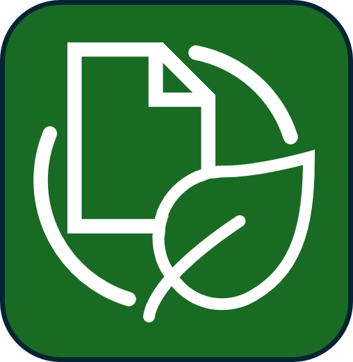
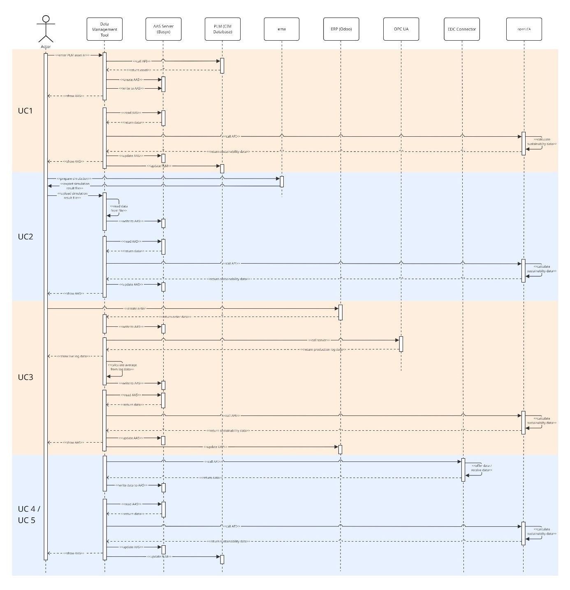

# Sustainability Data Integration KIT (SDI-KIT)
https://eclipse-tractusx.github.io/documentation/kit-framework/#kit-template 




---

## Table of Contents

- [Adoption View](#adoption-view)
  - [Introduction](#introduction)
  - [Vision](#vision)
  - [Mission](#mission)
  - [Synergies and Positioning within the Tractus-X Ecosystem](#synergies-and-positioning-within-the-tractus-x-ecosystem)
  - [Business Value](#business-value)
  - [Use Case / Domain Explanation](#use-case--domain-explanation)
    - [Today's Challenge](#todays-challenge)
    - [Use Cases](#use-cases)
    - [Regulatory Relevance](#regulatory-relevance)
    - [Value Chain Partners](#value-chain-partners)
  - [Whitepaper](#whitepaper)
  - [Standards](#standards)
- [Development View](#development-view)
  - [Architecture View](#architecture-view)
  - [Sequence View](#sequence-view)
  - [API Documentation](#api-documentation)
  - [Sample Data: TRACEpen](#sample-data-tracepen)
  - [Demonstrator Implementation in the Laboratory](#demonstrator-implementation-in-the-laboratory)
  - [The AAS Data Model, Submodels and Custom Submodels](#the-aas-data-model-submodels-and-custom-submodels)
- [Documentation](#documentation)
  - [Copyright Notice](#copyright-notice)
  - [Changelog](#changelog)
  - [NOTICE](#notice)
  - [References](#references)

# Adoption View

## Introduction

The **Sustainability Data Integration KIT (SDI-KIT)** provides a structured, interoperable approach to acquire, process, and operationalize sustainability-relevant data from established engineering systems. Using existing PLM systems as the central, reliable data foundation, the KIT progressively enriches this baseline with simulation, ERP, and OPC UA-connected production data across the entire product lifecycle.

The KIT is purpose-built for the Manufacturing-X dataspace and enables sovereign, cross-company exchange of product, process, and environmental data via standardized Asset Administration Shell (AAS) submodels and Eclipse Dataspace Connector (EDC)-based data sharing. It positions itself upstream of downstream use cases such as Digital Product Passports (DPP) and PCF exchange, by providing the primary sustainability data those use cases depend on.

**The SDI-KIT aims to:**
- use PLM master data as the reliable starting point for early-stage LCA,
- successively enrich this baseline with simulation results (e.g. EMA), order-specific ERP data, and OPC UA-based production measurements,
- enable flexible, method-agnostic calculation of sustainability indicators via OpenLCA API integration,
- store and version LCA inputs and results in a standardized AAS-based format, preserving source attribution across all data quality levels,
- support interoperable, sovereign data exchange within the Manufacturing-X dataspace via EDC connectors.

## Vision

**Integrating sustainability into product engineering — flexible, PLM-based assessment enriched by engineering and production data.**

PLM data forms the basis for the engineering of technical products. To enable flexible and robust assessments and decision making, data from the supply chain and the product lifecycle must be systematically consolidated to effectively support engineering decisions. The Sustainability Data Integration KIT documents use cases for the successive integration of simulation, ERP, and production data, flexible in choice of system, impact, and method, available at the point of engineering decisions.

## Mission

The SDI-KIT is provided to improve the reliability of sustainability assessments during product engineering. Early lifecycle assessments often rely on generic secondary data, although major environmental impacts are already influenced by engineering decisions at this stage.

The KIT addresses this gap by enabling a stepwise enrichment of sustainability-relevant data. It starts with PLM-based product master data and progressively integrates simulation results, ERP information, production measurements, and supplier-provided datasets.

All inputs, calculation results, metadata, and source information are stored in an AAS-based structure. This allows organizations to compare different data-quality levels, trace the origin of sustainability values, recalculate environmental indicators when better data becomes available, and share selected datasets sovereignly through the dataspace.

The SDI-KIT builds on Tractus-X standards and technical building blocks and specifically focuses on integrating, contextualizing and preparing sustainability-relevant product, process and operational data for environmental assessment and decision support [1].

## Synergies and Positioning within the Tractus-X Ecosystem

Like other KITs in the Tractus-X library, the **Sustainability Data Integration KIT** builds on established Tractus-X standards, interoperability mechanisms and technical building blocks. Its specific role is the integration, contextualization and preparation of sustainability-relevant product, process and operational data for environmental assessment and decision support. In contrast to downstream exchange or reporting KITs, the SDI-KIT focuses on the upstream creation of assessment-ready sustainability information from heterogeneous enterprise systems such as PLM, ERP, simulation environments and OPC UA-connected production systems. It therefore complements existing KITs by connecting engineering and production data with AAS-based sustainability data structures and method-agnostic LCA calculation workflows [1].

The **Digital Twin KIT** provides the primary technical foundation for the SDI-KIT. It defines the Tractus-X approach for standardized digital twins, including discovery, registry and submodel-based data access. This directly matches the SDI-KIT architecture, in which sustainability-relevant data is stored and versioned in AAS submodels and made available through AAS-compliant services.

The **Product Carbon Footprint Exchange KIT (PCF-KIT)** is the closest downstream counterpart of the SDI-KIT. Its focus is the standardized exchange of already prepared PCF information between business partners based on agreed semantic models, interfaces and governance rules. The SDI-KIT operates upstream of this exchange by preparing the primary data, assumptions and calculation inputs needed to derive robust environmental indicators.

The **EcoPass KIT** represents an important downstream integration point. It provides the framework for digital product passports based on Tractus-X concepts such as AAS, SSI, decentralized registries and sovereign data exchange. The SDI-KIT can serve as an upstream provider of sustainability-related content for such passports.

The **Modular Production KIT** is relevant where sustainability assessments depend on operational production data. It standardizes the exchange of shop-floor and production-related information, including planning, tracking and execution data.

The **Manufacturing as a Service KIT** is not a direct dependency of the SDI-KIT, but an adjacent KIT with complementary potential.

The **Geometry KIT** is a complementary engineering-data KIT. It standardizes the exchange of geometry and CAD-related information for secure cross-company engineering collaboration.

Further adjacent KITs, such as the **Industry Core KIT**, **Traceability KIT**, **Circularity KIT** and **Requirements KIT**, share parts of the broader engineering and lifecycle context but do not overlap with the main purpose of the SDI-KIT.

Overall, the SDI-KIT is positioned as a cross-cutting sustainability integration layer within the Tractus-X ecosystem. It reuses shared digital twin and dataspace infrastructure, consumes standardized data from adjacent KITs and enterprise systems, and provides sustainability-oriented outputs to downstream exchange and passport scenarios. Its distinguishing role is the stepwise enrichment of sustainability data across the product lifecycle, from early PLM-based estimations to simulation-, ERP- and production-data-enriched assessments, while preserving traceability, source attribution and recalculability in AAS-based structures [1].

## Business Value

The SDI-KIT creates business value by enabling solution providers and adopters to transform heterogeneous engineering, simulation, ERP, production and supplier data into structured, interoperable and source-attributed sustainability information.

### **Improved sustainability data quality through system integration**
The SDI-KIT enables the direct integration of data from existing enterprise and shop-floor systems, including PLM product structures, ERP bills of materials, simulation outputs and OPC UA-based production measurements. This allows generic secondary data to be progressively replaced by more context-specific engineering and operational data whenever available.

### **Flexible and method-agnostic sustainability assessment**
The SDI-KIT supports modular integration workflows that connect heterogeneous source systems with sustainability calculation services through standardized APIs. Environmental indicators can therefore be calculated, recalculated and compared whenever product, process or supplier data changes.

### **Progressive data quality enrichment across product lifecycle**
The SDI-KIT supports the stepwise enrichment of sustainability information from early engineering estimates to simulation-based, ERP-supported and production-data-enriched assessments.

### **Reduced integration effort and scalable solution design**
The SDI-KIT reduces the manual effort typically required to prepare and maintain sustainability data by providing reusable architectural patterns for automated data acquisition, mapping and storage.

## Use Case / Domain Explanation

### Today's Challenge

A significant share of the environmental impact of technical products is determined during the early stages of product engineering. At the same time, the data available at this stage is often incomplete, distributed across multiple systems and largely based on generic assumptions or secondary database values.

As product development progresses, additional information from simulation, ERP and production systems becomes available and can improve the quality of sustainability assessments. However, this information is usually fragmented across heterogeneous IT systems, represented in different formats and not directly connected to environmental assessment workflows.

The SDI-KIT addresses this challenge by providing a structured integration approach for consolidating product, process and operational data into AAS-based sustainability information that can be recalculated, versioned and shared across lifecycle stages and organizational boundaries.

### Use Cases

The SDI-KIT supports five primary use cases that together describe a continuous enrichment flow from early engineering data to cross-company sustainability data exchange.

#### **Use case 1: Early-stage Life Cycle Assessment from PLM data**
In the early product development phase, Life Cycle Assessment (LCA) starts with product master data from PLM systems. Product structure, bill of materials, CAD-derived properties, component weights and material information are retrieved via API, processed and mapped into the Asset Administration Shell (AAS).

#### **Use case 2: Simulation-based enrichment of sustainability data**
Once process simulation models are available, the initial engineering-based assessment can be refined with simulation-derived process data. Energy consumption, water consumption and cycle times per process step are extracted, mapped and stored in a dedicated simulation-related AAS structure.

#### **Use case 3: Production-data enriched Life Cycle Assessment**
When ERP and production data become available, the sustainability dataset can be further refined with order-specific and operational information. ERP systems contribute configuration data, BOM information, material specifications and order-related attributes. During execution, OPC UA-connected production systems provide measured data such as energy consumption, cycle times and timestamps at machine, batch or instance level.

#### **Use case 4: Provision of sustainability-related AAS data in the Manufacturing-X dataspace**
After lifecycle-related enrichment, selected AAS content can be shared within the Manufacturing-X dataspace via EDC-based exchange mechanisms.

#### **Use case 5: Cross-phase ingestion of supplier-provided sustainability data**
Supplier-provided sustainability information can be integrated throughout different lifecycle phases and at different levels of granularity, ranging from single attributes to complete AAS datasets.


Sequence diagram with marked out use cases

### Regulatory Relevance

The SDI-KIT supports compliance-oriented sustainability processes by improving the traceability, consistency and availability of sustainability-relevant data across product lifecycle stages.

It provides a structured foundation for preparing, updating and reusing sustainability information required for regulatory reporting, product transparency obligations and downstream compliance-related use cases.

## Value Chain Partners

The SDI-KIT creates value for multiple stakeholders across the value chain by providing a structured and interoperable approach to collect, enrich, calculate and share sustainability-relevant product and process data.

- **OEMs and manufacturers** benefit from more reliable sustainability assessments derived directly from engineering, simulation, ERP and production data.
- **Suppliers** can provide sustainability-relevant information in a more structured and reusable way without fundamentally changing their existing system landscape.
- **Solution providers** benefit from a clearly structured reference architecture and reusable integration patterns.
- **IT departments, platform operators and system integrators** gain a technical foundation for connecting heterogeneous enterprise and shop-floor systems.
- **Internal sustainability, compliance and engineering teams** benefit from a shared data foundation that connects technical product data with sustainability-related assessment results.

## Whitepaper

Optional section for linking a whitepaper that outlines the overall objectives of the KIT regarding a specific business problem.

## Standards

| Standard | Version | Reference |
| --- | --- | --- |
| CX-0002 Digital Twins in Catena-X |  |  |
| IDTA 02003 TechnicalData | 2.0 |  |
| IDTA 02034 BackendSpecificMaterialInformation | 2.0 |  |
| IDTA 02004 HandoverDocumentation | 2.0 |  |
| IDTA 02026 Models3D | 1.0 |  |
| IDTA 01002-3-0 Part 2 |  |  |
| ISO 14040/14044 |  |  |

# Development View

The development view provides an overview of the features of the KIT, the necessary components and their relationships and connections.

## Architecture View


General component diagram

The architecture is structured around the data management tool (DMT), implemented using the low-code platform Node-RED. It contains a user interface (UI). The DMT controls data flows, calls required APIs, performs auxiliary calculations and maps data to the correct metadata in the AAS data model.

The DMT can connect to different third-party systems and data sources. This includes primary production data as well as secondary data, for example from simulations, PLM systems or other systems. The DMT also connects to an AAS Server to save the data according to the AAS data model. To connect to the Tractus-X dataspace, the DMT can also manage the connection to an EDC Connector to enable secure data exchange.

For a complete minimal workflow, an AAS server implementation, a sustainability calculation tool and at least one data source are mandatory.

## Sequence View


Generic sequnce diagram of the DMT interacting with a third-party system

The process starts with user input via the UI. The data management tool calls the asset’s AAS via REST API and displays it in the UI. Next, the DMT calls a third-party tool or retrieves data via OPC UA or file upload. The DMT maps the retrieved data to the correct submodels and properties in the AAS.

Afterwards, the sustainability calculation starts. The DMT reads the AAS, retrieves all relevant data, passes it to the calculation tool and writes the returned results back into the AAS. Results are displayed in the UI.

Depending on the number of data sources and third-party systems, the process can be iterated several times. A higher number of data sources improves data quality and therefore the sustainability calculation result.

## API Documentation

The reference implementation does not provide its own API. Data can be transferred externally via the dataspace using the EDC connector.

### API documentation of used APIs within the system

| Component | API documentation |
| --- | --- |
| AAS Server | Specification of the Asset Administration Shell, Part 2: Application Programming Interfaces, 01002-3-0, https://app.swaggerhub.com/apis/Plattform_i40/AssetAdministrationShellRepositoryServiceSpecification/V3.0.3_SSP-001#/ |
| EDC Connector | EDC Connector provided by Smart Systems Hub, https://smart-systems-hub.github.io/docs/docs/tractus-x-edc-connector |

## The API documentation of third-party systems depends on the individually selected system and is therefore not included here.

## Sample Data: TRACEpen

Sample files are provided to assist with the use of the reference implementation.

| File | Description | Data format |
| --- | --- | --- |
| AAS file | Asset Administration Shell including all recorded data | `.aasx`, `.json` |
| ema export file | Exported simulation results for a production simulation | `.xlsx` |
| PLM BOM | Product BOM | `.xlsx` |
| PLM CAD | CAD model of the product | `.sldasm`, `.step` |
| ERP file | Product data from an ERP system | `.xml` |

## Demonstrator Implementation in the Laboratory


Architecture overview of the demonstrator implementation


Component diagram of the Decide4ECO KIT, including third party software


Sequence view of the Decide4ECO KIT


Diagram of the custom submodel "Data Sources" to store process data


Diagram of the custom submodel "ILCD" to store LCA data from different iteration

The reference implementation was developed and implemented at the Smart Automation Lab at the Heinz Nixdorf Institute. The software was implemented using the low-code platform Node-RED.

Most components are connected to the data management tool via a bidirectional REST API. This includes optional third-party systems such as a PLM system, OpenLCA and an ERP system, as well as necessary components such as the AAS Server and the EDC connector.

Other components are unidirectional, such as the OPC UA Servers that deliver real-time machine data via OPC UA and the ema Plant Designer simulation data, which is exported and uploaded into the data management tool.

## The AAS Data Model, Submodels and Custom Submodels

The Asset Administration Shell (AAS) for the asset is created via API. The AAS API documentation is standardized in the AAS standard “01002-3-0 Part 2: Application Programming Interfaces” [1].

The predefined AAS contains the following submodels:

| Submodel name | Short name, Version | IDTA Number / Custom |
| --- | --- | --- |
| Digital Nameplate for industrial equipment | Nameplate V3.0 | 02006 |
| Generic Frame for Technical Data for Industrial Equipment in Manufacturing | TechnicalData V2.0 | 02003 |
| Creation and classification of materials in an ERP, PDM/PLM and PIM system | BackendSpecificMaterialInformation | 02034 |
| Handover Documentation | HandoverDocumentation V2.0 | 02004 |
| Provision of 3D Models | Models3D V1.0 | 02026 |
| Data Sources for recorded and simulated production data | DataSources | custom |
| ILCD-based LCA data | ILCD | custom |

The custom submodel **Data Sources** stores production and simulation data in a process-specific way. The custom submodel **ILCD** stores LCA calculation results from different iterations and preserves traceability of data sources.

# Documentation

## Copyright Notice

Mandatory for every KIT. It **must** be included in every file, not only in the Adoption View. KIT documentation works under the **CC-BY-4.0** license.

It **must always** include the following copyright statement [1]:

```text
SPDX-FileCopyrightText: 2025 Contributors to the Eclipse Foundation
