# Sustainability Data Integration KIT (SDI-KIT)
https://eclipse-tractusx.github.io/documentation/kit-framework/#kit-template 


---

## Table of Contents

- [Getting Started](#getting-started)
- [Repository structure](#repository-structure)
- [Adoption View](#adoption-view)
  - [Introduction](#introduction)
  - [Vision](#vision)
  - [Mission](#mission)
  - [Synergies and Positioning within the Tractus-X Ecosystem](#synergies-and-positioning-within-the-tractus-x-ecosystem)
  - [Business Value](#business-value)
    - [Improved sustainability data quality through system integration](#improved-sustainability-data-quality-through-system-integration)
    - [Flexible and method-agnostic sustainability assessment](#flexible-and-method-agnostic-sustainability-assessment)
    - [Progressive data quality enrichment across product lifecycle](#progressive-data-quality-enrichment-across-product-lifecycle)
    - [Reduced integration effort and scalable solution design](#reduced-integration-effort-and-scalable-solution-design)
  - [Use Case / Domain Explanation](#use-case--domain-explanation)
    - [Today's Challenge](#todays-challenge)
    - [Use Cases](#use-cases)
      - [What of this runs today](#what-of-this-runs-today)
    - [Regulatory Relevance](#regulatory-relevance)
  - [Value Chain Partners](#value-chain-partners)
  - [Standards](#standards)
    - [Catena-X Standards](#catena-x-standards)
    - [Non-dataspace Standards](#non-dataspace-standards)
- [Development View](#development-view)
  - [Architecture View](#architecture-view)
    - [What is the reference implementation, and what is the demonstrator](#what-is-the-reference-implementation-and-what-is-the-demonstrator)
    - [The workflows one by one](#the-workflows-one-by-one)
    - [Interfaces and the dataspace](#interfaces-and-the-dataspace)
  - [Sequence View](#sequence-view)
  - [API Documentation](#api-documentation)
    - [API documentation of used APIs within the system](#api-documentation-of-used-apis-within-the-system)
  - [Sample Data: TRACEpen](#sample-data-tracepen)
  - [Demonstrator Implementation in the Laboratory](#demonstrator-implementation-in-the-laboratory)
  - [AAS Data Model, Submodels and Custom Submodels](#aas-data-model-submodels-and-custom-submodels)
  - [Data Sources and Their Effect on the Assessment](#data-sources-and-their-effect-on-the-assessment)
    - [Division by origin](#division-by-origin)
    - [Precedence](#precedence)
    - [Storage in the AAS](#storage-in-the-aas)
    - [Three entries per value](#three-entries-per-value)
    - [Effect on the result](#effect-on-the-result)
    - [Prerequisites in the openLCA model](#prerequisites-in-the-openlca-model)
      - [Data sources are independent of one another](#data-sources-are-independent-of-one-another)
    - [Connecting a different third-party system](#connecting-a-different-third-party-system)
- [Data Mapping](#data-mapping)
    - [Target Structure: Custom Submodels](#target-structure-custom-submodels)
    - [Stage 1: PLM System → intermediate JSON](#stage-1-plm-system--intermediate-json)
    - [Stage 2: Intermediate JSON → AAS Submodels](#stage-2-intermediate-json--aas-submodels)
    - [Stage 3: Simulation Export → DataSources](#stage-3-simulation-export--datasources)
    - [Stage 4: LCA Results → ILCD](#stage-4-lca-results--ilcd)
    - [Rebuilding the Mapping with Other Technologies](#rebuilding-the-mapping-with-other-technologies)
  - [PLM Connection (CONTACT Elements)](#plm-connection-contact-elements)
  - [What the flow does](#what-the-flow-does)
  - [Configuration](#configuration)
  - [The shell-building script](#the-shell-building-script)
  - [Behaviour worth knowing](#behaviour-worth-knowing)
  - [From the packages to the assessment](#from-the-packages-to-the-assessment)
- [ERP Connection (Odoo)](#erp-connection-odoo)
    - [Data sources in Odoo](#data-sources-in-odoo)
    - [Target structure in the AAS](#target-structure-in-the-aas)
    - [Flow sequence](#flow-sequence)
    - [Setting up the sample data](#setting-up-the-sample-data)
    - [Experience from building the connection](#experience-from-building-the-connection)
  - [Decision support for sustainable product engineering](#decision-support-for-sustainable-product-engineering)
    - [Dashboards for decision support](#dashboards-for-decision-support)
    - [Sample Data: Gripper of a robotic arm](#sample-data-gripper-of-a-robotic-arm)
- [Operations View](#operations-view)
    - [Deployment Baseline](#deployment-baseline)
    - [Implementation Status](#implementation-status)
  - [Guidelines Security](#guidelines-security)
    - [Security Requirements](#security-requirements)
    - [Restrictions of the reference implementation](#restrictions-of-the-reference-implementation)
    - [Reporting Vulnerabilities](#reporting-vulnerabilities)
  - [Guidelines Operation](#guidelines-operation)
    - [Non-Functional Requirements](#non-functional-requirements)
    - [Sizing](#sizing)
    - [Configuration](#configuration)
    - [Operational Procedures](#operational-procedures)
    - [Operational restrictions](#operational-restrictions)
  - [Guidelines Monitoring](#guidelines-monitoring)
    - [Technical Monitoring](#technical-monitoring)
    - [Functional Monitoring](#functional-monitoring)
    - [Alerting Recommendations](#alerting-recommendations)
    - [Monitoring restrictions](#monitoring-restrictions)
- [Industry Extension: Discrete Manufacturing](#industry-extension-discrete-manufacturing)
  - [What this sector contributes](#what-this-sector-contributes)
  - [Sector-specific standards](#sector-specific-standards)
  - [Three decisions an adopter has to make](#three-decisions-an-adopter-has-to-make)
  - [What this extension does not cover](#what-this-extension-does-not-cover)
- [Documentation](#documentation)
  - [Changelog](#changelog)
  - [References](#references)
  - [NOTICE](#notice)

## Getting Started

A complete setup for a new machine is described in
[`getting-started/`](getting-started/README.md). The script there checks the
prerequisites, starts the AAS server, imports the sample data, verifies the
openLCA connection and assembles the flows for Node-RED:

```bash
cd getting-started
python setup.py
```

## Repository structure

| Path | Contents |
| --- | --- |
| `src/` | the integration flows for Node-RED and the scripts they call |
| `getting-started/` | setup script, container definition, configuration template, tutorial, openLCA data package |
| `docs/sample_data/` | the administration shells of the example product, the simulation export and the bill of material |
| `docs/img/` | the figures of this document |
| `INSTALL.md` | installation in short form |

```
src/  PLM.json                  PLM        -> AASX packages per part
      Odoo_ERP.json             ERP        -> DataSources / ERP
      EMA.json                  simulation -> DataSources / Simulation
      OPCUA_Manufacturing.json  machines   -> DataSources / MachineData of the part
      OpenLCA_to_AAS.json       all sources -> ILCD with the result
      Assembly_Booking.json     ERP        -> serial numbers and the assembly record
      Assembly_Backfill.json    ERP        -> restores assembly records into the shell
      Dashboard.json            the web page the chain is operated from
```

Each file can be imported on its own; none of them refers to a node in
another. The dashboard brings its own user interface base, so the order of
import does not matter.

# Adoption View

## Introduction

The **Sustainability Data Integration KIT (SDI-KIT)** provides a structured, interoperable approach to acquire, process, and operationalize sustainability-relevant data from established engineering systems. Using existing PLM systems as the central, reliable data foundation, the KIT progressively enriches this baseline with simulation, ERP, and OPC UA-connected production data across the entire product lifecycle.

The KIT is purpose-built for the Manufacturing-X dataspace and enables sovereign, cross-company exchange of product, process, and environmental data via standardized Asset Administration Shell (AAS) submodels and Eclipse Dataspace Connector (EDC)-based data sharing. It positions itself upstream of downstream use cases such as Digital Product Passports (DPP) and PCF exchange, by providing the primary sustainability data those use cases depend on.

**The SDI-KIT aims to:**
- use PLM master data as the reliable starting point for early-stage LCA,
- successively enrich this baseline with simulation results (e.g. EMA), order-specific ERP data, and OPC UA-based production measurements,
- enable flexible, method-agnostic calculation of sustainability indicators via OpenLCA API integration,
- store and version LCA inputs and results in a standardized AAS-based format, preserving source attribution across all data quality levels,
- support interoperable, sovereign data exchange within the Manufacturing-X dataspace via EDC connectors.

## Vision

**Integrating sustainability into product engineering — flexible, PLM-based assessment enriched by engineering and production data.**

PLM data forms the basis for the engineering of technical products. To enable flexible and robust assessments and decision making, data from the supply chain and the product lifecycle must be systematically consolidated to effectively support engineering decisions. The Sustainability Data Integration KIT documents use cases for the successive integration of simulation, ERP, and production data, flexible in choice of system, impact, and method, available at the point of engineering decisions.

## Mission

The SDI-KIT is provided to improve the reliability of sustainability assessments during product engineering. Early lifecycle assessments often rely on generic secondary data, although major environmental impacts are already influenced by engineering decisions at this stage.

The KIT addresses this gap by enabling a stepwise enrichment of sustainability-relevant data. It starts with PLM-based product master data and progressively integrates simulation results, ERP information, production measurements, and supplier-provided datasets.

All inputs, calculation results, metadata, and source information are stored in an AAS-based structure. This allows organizations to compare different data-quality levels, trace the origin of sustainability values, recalculate environmental indicators when better data becomes available, and share selected datasets sovereignly through the dataspace.

The SDI-KIT builds on Tractus-X standards and technical building blocks and specifically focuses on integrating, contextualizing and preparing sustainability-relevant product, process and operational data for environmental assessment and decision support [1].

## Synergies and Positioning within the Tractus-X Ecosystem

Like other KITs in the Tractus-X library, the **Sustainability Data Integration KIT** builds on established Tractus-X standards, interoperability mechanisms and technical building blocks. Its specific role is the integration, contextualization and preparation of sustainability-relevant product, process and operational data for environmental assessment and decision support. In contrast to downstream exchange or reporting KITs, the SDI-KIT focuses on the upstream creation of assessment-ready sustainability information from heterogeneous enterprise systems such as PLM, ERP, simulation environments and OPC UA-connected production systems. It therefore complements existing KITs by connecting engineering and production data with AAS-based sustainability data structures and method-agnostic LCA calculation workflows.

The **Digital Twin KIT** provides the primary technical foundation for the SDI-KIT. It defines the Tractus-X approach for standardized digital twins, including discovery, registry and submodel-based data access. This directly matches the SDI-KIT architecture, in which sustainability-relevant data is stored and versioned in AAS submodels and made available through AAS-compliant services. The SDI-KIT relies on this infrastructure to expose and consume data from PLM, ERP, simulation and shop-floor sources in an interoperable and sovereign manner. The distinction in scope is clear: the Digital Twin KIT defines how twins, registries and interfaces are structured and accessed, while the SDI-KIT is responsible for ingesting, harmonizing and enriching the underlying source data and linking it to LCA-relevant semantics and calculation results.

The **Product Carbon Footprint Exchange KIT (PCF-KIT)** is the closest downstream counterpart of the SDI-KIT. Its focus is the standardized exchange of already prepared PCF information between business partners based on agreed semantic models, interfaces and governance rules. The SDI-KIT operates upstream of this exchange by preparing the primary data, assumptions and calculation inputs needed to derive robust environmental indicators. This includes not only carbon-related values but also broader sustainability information generated from PLM structures, simulation outputs, ERP data and production measurements. In this sense, the SDI-KIT can provide validated and traceable sustainability outputs that may later be exchanged through the PCF Exchange KIT, while the latter does not address data integration, multi-source enrichment or iterative LCA preparation.

The **EcoPass KIT** represents an important downstream integration point. It provides the framework for digital product passports based on Tractus-X concepts such as AAS, SSI, decentralized registries and sovereign data exchange. The SDI-KIT can serve as an upstream provider of sustainability-related content for such passports, especially where environmental footprint, product-related compliance data or lifecycle-related sustainability evidence is required. This relationship is consistent with the SDI-KIT mission: sustainability information is first collected, enriched, stored and versioned in AAS-based structures and can then be selectively shared into downstream passport scenarios. The EcoPass KIT focuses on the structured provision and consumption of passport information, whereas the SDI-KIT focuses on generating and contextualizing the sustainability data that may populate such passport structures.

The **Modular Production KIT** is relevant where sustainability assessments depend on operational production data. It standardizes the exchange of shop-floor and production-related information, including planning, tracking and execution data. This creates a structured interoperability layer for production-related primary data, which the SDI-KIT can use to improve the quality and granularity of environmental assessments. This is closely aligned with the SDI-KIT use cases, where OPC UA-connected production systems provide measured energy, cycle-time and timestamp data that is aggregated and stored in dedicated AAS submodels. The boundary remains distinct: the Modular Production KIT standardizes operational production-data exchange, whereas the SDI-KIT interprets and transforms such data into sustainability-relevant information and environmental indicators.

The **Manufacturing as a Service KIT** is not a direct dependency of the SDI-KIT, but an adjacent KIT with complementary potential. Its purpose is the standardized publication, discovery and matching of manufacturing capabilities and quotation requests within distributed manufacturing networks. Where alternative suppliers, processes or manufacturing setups are considered, the SDI-KIT can contribute comparative sustainability assessments based on integrated lifecycle and production data. However, the SDI-KIT does not perform capability matchmaking, quotation orchestration or network-based manufacturing allocation. Its role is limited to the sustainability-oriented interpretation of such alternatives.

The **Geometry KIT** is a complementary engineering-data KIT. It standardizes the exchange of geometry and CAD-related information for secure cross-company engineering collaboration. This is relevant to the SDI-KIT because product master data from PLM systems may include geometry-derived properties such as mass, material allocation or 3D-related product structure information that influence environmental modelling. In the SDI-KIT architecture, such information forms part of the early-stage product baseline used for initial LCA calculations. The Geometry KIT therefore contributes engineering context, while the SDI-KIT uses this context for sustainability interpretation and comparison.

Further adjacent KITs, such as the **Industry Core KIT**, **Traceability KIT**, **Circularity KIT** and **Requirements KIT**, share parts of the broader engineering and lifecycle context but do not overlap with the main purpose of the SDI-KIT. Industry Core and Traceability focus on standardized product identities, part structures and lifecycle relations; Circularity focuses on end-of-life and circular-economy use cases; and Requirements addresses the exchange of engineering requirements. The SDI-KIT can reuse selected structures or identifiers from these contexts, but its distinct contribution remains the transformation of heterogeneous source data into harmonized, source-attributed and assessment-ready sustainability information.

Overall, the SDI-KIT is positioned as a cross-cutting sustainability integration layer within the Tractus-X ecosystem. It reuses shared digital twin and dataspace infrastructure, consumes standardized data from adjacent KITs and enterprise systems, and provides sustainability-oriented outputs to downstream exchange and passport scenarios. Its distinguishing role is the stepwise enrichment of sustainability data across the product lifecycle, from early PLM-based estimations to simulation-, ERP- and production-data-enriched assessments, while preserving traceability, source attribution and recalculability in AAS-based structures.

*Overview used Services in the SDI-KIT*
| Service Name | Description | Reference Implementation | Standardized in |
| --- | --- | --- | --- |
| Digital Twin Registry | An exhaustive list of all Submodel Servers, with link to their assets, adhering to the AAS Registry API. Responsible for having the Digital Twins of the provider and indicating the endpoints to the Passport Aspects. |  | CX-0002 |
| Submodel Server | The data source adhering to a subset of the Submodel API as defined in AAS Part-2 3.0, where the Passport Aspects are stored. | Eclipse BaSyx | CX-0002 / Digital Twin KIT |
| EDC | Main gateway to the network. In this use case, two EDCs need to exist: one connected to the Digital Product Pass (EcoPass KIT) as EDC Consumer, and another connected to the provider Catena-X components as EDC Provider. | Tractus-X EDC, provided by Smart Systems Hub | CX-0018 |
| PLM/ERP Integration | Connection to internal enterprise systems for managing part types, part instances, data chains, and links between twins. | Part Type, Part Instance, Data Chains, Linking of Twins | Industry Core KIT |

## Business Value

The SDI-KIT creates business value by enabling solution providers and adopters to transform heterogeneous engineering, simulation, ERP, production and supplier data into structured, interoperable and source-attributed sustainability information. Rather than prescribing a fixed toolchain or a single assessment method, the KIT provides reusable integration patterns for building sustainability data pipelines that can be adapted to different industrial environments and business models. In this way, the SDI-KIT supports the implementation of commercial and non-profit solutions in the Tractus-X and Manufacturing-X ecosystem that depend on reliable, shareable and assessment-ready sustainability data.

### **Improved sustainability data quality through system integration**
The SDI-KIT enables the direct integration of data from existing enterprise and shop-floor systems, including PLM product structures, ERP bills of materials, simulation outputs and OPC UA-based production measurements. This allows generic secondary data to be progressively replaced by more context-specific engineering and operational data whenever available. As a result, sustainability assessments become more reliable, better traceable and more useful for engineering and sourcing decisions.

### **Flexible and method-agnostic sustainability assessment**
The SDI-KIT supports modular integration workflows that connect heterogeneous source systems with sustainability calculation services through standardized APIs. Environmental indicators can therefore be calculated, recalculated and compared whenever product, process or supplier data changes. This gives solution providers and adopters the flexibility to integrate different tools, methods and impact categories without being locked into one specific assessment approach.
### **Progressive data quality enrichment across product lifecycle**
The SDI-KIT supports the stepwise enrichment of sustainability information from early engineering estimates to simulation-based, ERP-supported and production-data-enriched assessments. Instead of replacing previous results, new data-quality levels can coexist with earlier estimates in a traceable and versionable way. This makes it possible to compare assumptions, document data provenance and improve sustainability results over time as more specific lifecycle data becomes available.

### **Reduced integration effort and scalable solution design**
The SDI-KIT reduces the manual effort typically required to prepare and maintain sustainability data by providing reusable architectural patterns for automated data acquisition, mapping and storage. Its modular structure allows adopters to integrate only those systems that are available in their existing IT landscape. This supports scalable solution design across heterogeneous industrial environments, ranging from highly digitalized enterprises to organizations with limited system integration maturity.

## Use Case / Domain Explanation

### Today's Challenge

A significant share of the environmental impact of technical products is determined during the early stages of product engineering. At the same time, the data available at this stage is often incomplete, distributed across multiple systems and largely based on generic assumptions or secondary database values.

As product development progresses, additional information from simulation, ERP and production systems becomes available and can improve the quality of sustainability assessments. However, this information is usually fragmented across heterogeneous IT systems, represented in different formats and not directly connected to environmental assessment workflows.

The SDI-KIT addresses this challenge by providing a structured integration approach for consolidating product, process and operational data into AAS-based sustainability information that can be recalculated, versioned and shared across lifecycle stages and organizational boundaries.

### Use Cases

The SDI-KIT supports five primary use cases that together describe a continuous enrichment flow from early engineering data to cross-company sustainability data exchange. The use cases are defined as generic integration patterns and can therefore be implemented with different PLM, ERP, simulation, production, LCA, AAS and dataspace technologies. Taken together, they show how sustainability-relevant information can be incrementally improved, reused and shared across product lifecycle stages.

#### **Use case 1: Early-stage Life Cycle Assessment from PLM data**
In the early product development phase, Life Cycle Assessment (LCA) starts with product master data from PLM systems. Product structure, bill of materials, CAD-derived properties, component weights and material information are retrieved via API, processed and mapped into the Asset Administration Shell (AAS). Based on this initial dataset, a sustainability calculation service can derive the first environmental assessment results. The resulting outputs, together with the corresponding input data and metadata, are stored in the AAS and form the baseline for subsequent enrichment steps.
This use case establishes the earliest available sustainability baseline directly from engineering data. It enables organizations to move sustainability assessment closer to the point of design decision-making, even before detailed production information is available.

#### **Use case 2: Simulation-based enrichment of sustainability data**
Once process simulation models are available, the initial engineering-based assessment can be refined with simulation-derived process data. Energy consumption, water consumption and cycle times per process step are extracted, mapped and stored in a dedicated simulation-related AAS structure. The sustainability calculation is then repeated using the updated dataset.
Instead of overwriting earlier results, the SDI-KIT supports the storage of an additional, explicitly attributed result set. This preserves the original PLM-based assessment and enables the comparison of different data-quality levels within the same AAS context.

#### **Use case 3: Production-data enriched Life Cycle Assessment**
When ERP and production data become available, the sustainability dataset can be further refined with order-specific and operational information. ERP systems contribute configuration data, BOM information, material specifications and order-related attributes. During execution, OPC UA-connected production systems provide measured data such as energy consumption, cycle times and timestamps at machine, batch or instance level. These values are aggregated and stored in production-related AAS structures and can be used to recalculate environmental indicators on a more specific basis.
This use case increases the reliability of the LCA by replacing assumptions with measured or order-specific values. It therefore strengthens the reliability of sustainability information for operational decision-making, customer communication and later downstream exchange scenarios.

Turning a power curve into a defensible figure takes three steps, and each of
them is a decision an adopter has to make explicitly rather than a calculation
that follows from the data:

**A threshold separates production from standby.** A machine under power is not
a machine that is working. In the demonstrator the mill idles between 660 and
730 W and cuts above 2800 W; a threshold set too low turns hours of standby into
recorded production, and nobody notices because the resulting numbers look
plausible. The threshold is therefore derived from a measured curve per machine
and stored with the measurement, not assumed.

**Energy per piece is an allocation, not a measurement.** A print run producing
25 pen tips yields one energy figure for 25 pieces. The KIT stores the piece
count and states in the submodel that the per-piece value is an average over the
run, so that a reader can tell a measured single piece from an allocated share.

**A measurement is only evidence if it belongs to a piece.** A run recorded
against a part *type* supports eco-design comparisons but cannot support a
product passport: it says what a bolt of this kind costs, not what this bolt
cost. The KIT therefore binds each run to the serial number of the piece it
produced, taken from the assembly booked in the ERP. Where that booking is
missing, the origin of the assignment is written into the submodel instead of
being left implicit.

#### **Use case 4: Provision of sustainability-related AAS data in the Manufacturing-X dataspace**
After lifecycle-related enrichment, selected AAS content can be shared within the Manufacturing-X dataspace via EDC-based exchange mechanisms. Depending on the applicable policies and business context, this may range from single submodels to larger sustainability-relevant datasets. Downstream stakeholders such as customers, OEMs or certification-related actors can consume this information and integrate it into their own AAS, PLM or sustainability processes.
This use case establishes the standardized outbound flow of sustainability-related product information from internal enterprise systems into the wider ecosystem. It also creates the basis for downstream scenarios such as collaborative assessments, regulatory transparency and Digital Product Passport-related data provision.

#### **Use case 5: Cross-phase ingestion of supplier-provided sustainability data**
Supplier-provided sustainability information can be integrated throughout different lifecycle phases and at different levels of granularity, ranging from single attributes to complete AAS datasets. Incoming data is transferred via dataspace-compatible exchange mechanisms, processed by the integration layer and linked to the corresponding internal product structures. Existing values can be updated where appropriate, while additional information can be added in parallel with explicit source attribution.
This use case supports continuous inbound enrichment of sustainability information from external partners. It enables organizations to complement internally generated values with supplier-specific data while maintaining traceability, coexistence of multiple data sources and the possibility to recalculate sustainability results as better information becomes available.


<em>Sequence diagram with marked out use cases</em>

#### What of this runs today

The five use cases describe the integration patterns the KIT is built around.
They are not all implemented to the same depth, and a reader deserves to know
which is which before drawing conclusions from a diagram.

| Use case | In the published reference implementation | Outstanding |
| --- | --- | --- |
| 1 PLM baseline | Shells are built from PLM master data; weight, material and bill of material reach the `PLM` data source. Verified against CONTACT Elements. | The PLM writes the product weight, not a bill of material broken down by part; per-part masses arrive with the ERP. |
| 2 Simulation enrichment | The simulation export is read and stored as `Simulation`; the assembly energy enters the calculation as its own parameter. | The interface is a file upload, not an online API, so enrichment is triggered manually. |
| 3 Production data | ERP quantities and orders, machine measurements per run with threshold, piece count and serial number, and the assembly booking that ties a run to a piece. Runs end to end. | Threshold and part assignment are configured per machine; the KIT states their origin rather than deriving them. |
| 4 Provision through the dataspace | nothing yet | The connector integration is not published yet. The AAS content it would offer exists and is exchangeable. |
| 5 Ingestion of supplier data | nothing yet | Same connector integration; the target structures in `DataSources` already carry source attribution per value. |

Use cases 4 and 5 are the reason the EDC connector appears throughout this
document even though its integration flow is still outstanding: they exist only
through it. The architecture, the standards chapter and the sequence view are
written for the complete scope, so that the outstanding piece slots into a
described place rather than changing the design around it. The detailed
integration status is in [Implementation Status](#implementation-status).

### Regulatory Relevance

The SDI-KIT supports compliance-oriented sustainability processes by improving the traceability, consistency and availability of sustainability-relevant data across product lifecycle stages. It provides a structured foundation for preparing, updating and reusing sustainability information required for regulatory reporting, product transparency obligations and downstream compliance-related use cases.
By integrating engineering, simulation, ERP, production and supplier data within a unified AAS-based framework, the SDI-KIT helps reduce the manual effort typically associated with collecting and consolidating regulatory-relevant information. At the same time, it improves the robustness and auditability of sustainability-related decision-making by preserving source attribution, data-quality evolution and recalculability over time.
In this way, the SDI-KIT can support organizations in preparing data for regulatory and market-driven requirements such as Digital Product Passport scenarios, the EU Ecodesign context, carbon-related reporting requirements and supply-chain-related transparency obligations. The KIT itself does not implement regulatory compliance logic. Rather, it provides the interoperable data foundation on which compliance-oriented applications and reporting processes can build.

## Value Chain Partners

The SDI-KIT creates value for multiple stakeholders across the value chain by providing a structured and interoperable approach to collect, enrich, calculate and share sustainability-relevant product and process data.

**OEMs and manufacturers** benefit from more reliable sustainability assessments derived directly from engineering, simulation, ERP and production data. This supports earlier and better-informed decisions in product engineering, sourcing and production planning. Because data provenance and enrichment stages are preserved in AAS-based structures, different data-quality levels remain transparent and comparable over time.

**Suppliers** can provide sustainability-relevant information in a more structured and reusable way without fundamentally changing their existing system landscape. The SDI-KIT supports the gradual integration of supplier-specific data, ranging from single attributes to larger structured datasets, and enables this information to be linked with customer-side product and process contexts. This lowers the barrier for participation in interoperable sustainability data exchange and improves the quality of shared upstream information.

**Solution providers**, including PLM, ERP, simulation, AAS and sustainability-software vendors, benefit from a clearly structured reference architecture and reusable integration patterns. The SDI-KIT shows how existing system capabilities can be connected to AAS-based sustainability data structures and dataspace-compatible exchange mechanisms. This creates a practical foundation for developing commercial or non-profit solutions that integrate into the Tractus-X and Manufacturing-X ecosystem.
IT departments, platform operators and system integrators gain a technical foundation for connecting heterogeneous enterprise and shop-floor systems to interoperable sustainability workflows. The SDI-KIT reduces integration complexity by providing a consistent approach for mapping source data into AAS-based structures and linking it with calculation and exchange processes. This supports scalable implementation across different organizational and technical environments.

**Internal sustainability**, compliance and engineering teams benefit from a shared data foundation that connects technical product data with sustainability-related assessment results. This improves collaboration between traditionally separated domains and supports the consistent preparation of information for internal analyses, customer communication and regulatory-facing processes.

## Standards

The Sustainability Data Integration KIT (SDI-KIT) does not define new dataspace standards. It applies the existing Catena-X standardisation framework to the integration of sustainability-relevant product, process and operational data. The KIT acts as an **upstream data-integration layer**: it produces AAS-based, source-attributed sustainability data that downstream KITs (PCF Exchange, EcoPass, Circularity) consume through their own standardised aspect models.

The compliance levels used in the tables below are:

- **Mandatory**: must be fulfilled by any implementation of the SDI-KIT operated inside a Catena-X / Manufacturing-X dataspace.
- **Recommended**: significantly improves interoperability and downstream reuse of the sustainability data; not required for a functioning implementation.
- **Optional**: defines the interface towards neighbouring use cases; referenced so that adopters can align their data structures.

Participation in the dataspace additionally requires the general onboarding and identity standards (CX-0006 Registration and Initial Onboarding, CX-0049 DID Document Schema, CX-0050 Catena-X Specific Credentials, CX-0149 Wallet Requirements). These are fulfilled by the operating environment of the participant and are not implemented by the SDI-KIT.

### Catena-X Standards

#### Standards applied by the SDI-KIT

| Standard | Version | Description | Compliance | Link |
| --- | --- | --- | --- | --- |
| CX-0002 Digital Twins in Catena-X | 2.4.0 | Defines the AAS-based digital twin, the Digital Twin Registry and the Submodel Service API. All sustainability data of the KIT (product master data, simulation data, production data, LCA inputs and results) is stored in AAS submodels and exposed through an AAS-conformant submodel server. Type-AAS and instance-AAS creation, submodel descriptors and `semanticId` registration follow this standard. | Mandatory | [go to standard](https://catenax-ev.github.io/docs/standards/CX-0002-DigitalTwinsInCatenaX) |
| CX-0018 Dataspace Connectivity | 4.2 | Defines the connector (EDC) and the Dataspace Protocol for sovereign data exchange. Applied in use case 4 (provision of sustainability data) and use case 5 (ingestion of supplier-provided data). The data management tool interacts with the EDC via its management API. | Mandatory | [go to standard](https://catenax-ev.github.io/docs/standards/CX-0018-DataspaceConnectivity) |
| CX-0003 SAMM Aspect Meta Model | 1.3.0 | Defines how aspect models are modelled and how semantic IDs are formed (`urn:samm:io.catenax.…`). Applies to every submodel that is offered into the dataspace, including the custom submodels `DataSources` and `ILCD`. | Mandatory | [go to standard](https://catenax-ev.github.io/docs/standards/CX-0003-SAMMSemanticAspectMetaModel) |
| CX-0001 Participant Agent Registration | 1.2.1 | Registration and discovery of the participant agent (EDC) of a business partner. Used when the KIT resolves the connector endpoint of a supplier or customer. | Mandatory | [go to standard](https://catenax-ev.github.io/docs/standards/CX-0001-ParticipantAgentRegistration) |
| CX-0010 Business Partner Number | 3.0.1 | Unique identifier of the data-providing and data-consuming organisation. Basis for the source attribution of externally provided sustainability values and for access and usage policies. | Mandatory | [go to standard](https://catenax-ev.github.io/docs/standards/CX-0010-BusinessPartnerNumber) |
| CX-0053 Discovery Finder and BPN Discovery Service APIs | 1.1.1 | Resolution from a business-partner or asset identifier to the corresponding Digital Twin Registry. Required as soon as sustainability data is consumed from a partner instead of the local AAS server. | Mandatory | [go to standard](https://catenax-ev.github.io/docs/standards/CX-0053-BPNDiscoveryServiceAPIs) |
| CX-0152 Policy Constraints for Data Exchange | 1.0.0 | Standardised access and usage policies attached to a data offer. Applied when sustainability submodels are published as EDC assets, since sustainability data is normally shared under restricted, purpose-bound policies. | Mandatory | [go to standard](https://catenax-ev.github.io/docs/standards/CX-0152-PolicyConstrainsForDataExchange) |
| CX-0151 Industry Core: Basics | 1.1.0 | Rules for twin creation, identifier formats (`urn:uuid:<UUIDv4>`) and message headers. The SDI-KIT follows the identifier and twin-granularity rules for its type- and instance-AAS. | Recommended | [go to standard](https://catenax-ev.github.io/docs/standards/CX-0151-IndustryCoreBasics) |
| CX-0126 Industry Core: Part Type | 2.1.1 | Type-level digital twin and `PartTypeInformation` aspect. Corresponds to the type-AAS created from PLM master data in use case 1 and makes the twin discoverable for all other Catena-X use cases. | Recommended | [go to standard](https://catenax-ev.github.io/docs/standards/CX-0126-IndustryCorePartType) |
| CX-0127 Industry Core: Part Instance | 2.0.2 | Instance-level digital twin (`SerialPart`, `Batch`). Corresponds to the instance-AAS in use case 3, where order-specific ERP data and OPC UA production measurements are stored per manufactured item or batch. | Recommended | [go to standard](https://catenax-ev.github.io/docs/standards/CX-0127-IndustryCorePartInstance) |
| CX-0154 Digital Master Data | 1.0.1 | Aspect model for the exchange of engineering master data (component properties, materials, 2D/3D models, test results) before physical parts exist. Directly matches the PLM-derived baseline of use case 1 and is the standardised counterpart to the IDTA submodels used internally. | Recommended | [go to standard](https://catenax-ev.github.io/docs/standards/CX-0154-MasterDataManagement) |
| CX-0136 Use Case PCF | 2.2.2 | `Pcf` aspect model and PCF request/response exchange. The carbon-related results stored in the custom `ILCD` submodel are mapped to this aspect in order to be exchanged via the PCF Exchange KIT. | Recommended | [go to standard](https://catenax-ev.github.io/docs/standards/CX-0136-UseCasePCF) |
| CX-0007 Minimal Data Provider Service Offering | 1.1.1 | Functional building blocks of a data-provisioning tool (frontend, backend, persistence, EDC, DTR, identity). The data management tool of the SDI-KIT is such a tool; the standard defines the minimum functional scope for adopters without a full IT integration. | Recommended | [go to standard](https://catenax-ev.github.io/docs/standards/CX-0007-MinimalDataProviderServicesOffering) |
| CX-0055 Data Processing Patterns for IT System Integration | 1.2.0 | Reference patterns for connecting backend IT systems (PLM, ERP, MES) to dataspace components. Directly applicable to the data management tool as the integration layer of the KIT. | Recommended | [go to standard](https://catenax-ev.github.io/docs/standards/CX-0055-DataProcessingPatternsforITSystemIntegration) |
| CX-0044 ECLASS | 1.0.2 | Classification and property dictionary. Used for the semantic classification of material and technical properties taken from PLM and ERP and as source of `semanticId` references inside the IDTA submodels. | Recommended | [go to standard](https://catenax-ev.github.io/docs/standards/CX-0044-ECLASS) |

#### Adjacent standards

These standards are not implemented by the SDI-KIT. They define the target structures for the sustainability data once it leaves the KIT, or the dataspace-side counterparts of data the KIT acquires internally.

| Standard | Version | Relation to the SDI-KIT | Compliance | Link |
| --- | --- | --- | --- | --- |
| CX-0143 Use Case Circular Economy – Digital Product Passport | 1.2.0 | DPP aspect model used by the EcoPass KIT. Sustainability values, material composition and recycled-content shares produced by the SDI-KIT are candidate inputs for a DPP. | Optional | [go to standard](https://catenax-ev.github.io/docs/standards/CX-0143-UseCaseCircularEconomyDigitalProductPassportStandard/introduction) |
| CX-0131 Circularity Core | 1.1.1 | Aspect models for secondary material content and end-of-life information; basis for the recycled-content analysis in the decision-support dashboards. | Optional | [go to standard](https://catenax-ev.github.io/docs/standards/CX-0131-CircularityCore) |
| CX-0142 Shop Floor Information Service | 1.0.1 | Standardised provision of shop-floor information; dataspace-side counterpart to the OPC UA production data acquired internally in use case 3. | Optional | [go to standard](https://catenax-ev.github.io/docs/standards/CX-0142-ShopFloorInformationService) |
| CX-0133 Online Control and Simulation | 2.0.1 | Exchange of simulation-related information between partners; neighbouring standard to use case 2, where simulation results are used internally to enrich the assessment. | Optional | [go to standard](https://catenax-ev.github.io/docs/standards/CX-0133-OnlineControlandSimulation) |
| CX-0156 Geometry | 1.0.0 | Exchange of CAD/geometry data; source of geometry-derived properties (mass, volume, material allocation) used as LCA input, complementing the IDTA `Models3D` submodel. | Optional | [go to standard](https://catenax-ev.github.io/docs/standards/CX-0156-Geometry) |
| CX-0155 Requirements Engineering | 1.0.1 | Exchange of engineering requirements; relevant for the effect-chain analysis in the knowledge graph, where requirements, functions and artefacts are linked. | Optional | [go to standard](https://catenax-ev.github.io/docs/standards/CX-0155-RequirementsEngineering) |
| CX-0084 Federated Queries in Data Spaces | 1.2.0 | Federated semantic querying across participants; evolution path for the Neo4j-based knowledge graph of the decision-support part of the KIT. | Optional | [go to standard](https://catenax-ev.github.io/docs/standards/CX-0084-FederatedQueriesInDataSpaces) |

### Non-dataspace Standards

The following standards are not Catena-X standards but are normative for the internal data structures, interfaces and assessment methods of the SDI-KIT.

| Standard | Version | Description | Compliance | Link |
| --- | --- | --- | --- | --- |
| IDTA 01001 Asset Administration Shell – Part 1: Metamodel | 3.0 | Metamodel of the AAS; basis for all submodels, submodel element collections and submodel element lists used in the KIT. | Mandatory | [idtwin.org](https://industrialdigitaltwin.org/en/content-hub/aasspecifications) |
| IDTA 01002 Asset Administration Shell – Part 2: Application Programming Interfaces | 3.0.3 | REST API used by the data management tool to create, read and update AAS and submodels on the AAS server. CX-0002 v2.4.0 requires version 3.2 for twins exposed to the dataspace. | Mandatory | [swaggerhub](https://app.swaggerhub.com/apis/Plattform_i40/AssetAdministrationShellRepositoryServiceSpecification/V3.0.3_SSP-001) |
| IDTA 01005 Asset Administration Shell – Part 5: Package File Format (AASX) | 3.0 | Exchange format of the provided sample data (`.aasx`). | Mandatory | [idtwin.org](https://industrialdigitaltwin.org/en/content-hub/aasspecifications) |
| IDTA 02006 Digital Nameplate for Industrial Equipment | 3.0 | Submodel of the preconfigured AAS; carries manufacturer and product identification as well as per-instance markings. | Mandatory | [idtwin.org](https://industrialdigitaltwin.org/en/content-hub/submodels) |
| IDTA 02003 Generic Frame for Technical Data for Industrial Equipment in Manufacturing | 2.0 | Submodel for technical product properties taken from PLM (e.g. mass, dimensions) that feed the early-stage LCA. | Mandatory | [idtwin.org](https://industrialdigitaltwin.org/en/content-hub/submodels) |
| IDTA 02034 Creation and Classification of Materials in ERP, PDM/PLM and PIM Systems | 2.0 | Submodel for material information and classification; input for material-related environmental impacts. | Mandatory | [idtwin.org](https://industrialdigitaltwin.org/en/content-hub/submodels) |
| IDTA 02004 Handover Documentation | 2.0 | Submodel for accompanying product documentation such as LCA reports, datasheets and certificates. | Mandatory | [idtwin.org](https://industrialdigitaltwin.org/en/content-hub/submodels) |
| IDTA 02026 Provision of 3D Models | 1.0 | Submodel referencing CAD/3D models of the product; source of geometry-derived LCA input data. | Mandatory | [idtwin.org](https://industrialdigitaltwin.org/en/content-hub/submodels) |
| ISO 14040 / ISO 14044 | 2006 | Methodological framework of the Life Cycle Assessment performed by the connected calculation tool: goal and scope definition, inventory analysis, impact assessment, interpretation. | Mandatory | [iso.org](https://www.iso.org/standard/37456.html) |
| ILCD format (EC-JRC International Reference Life Cycle Data System) | 1.1 | Data format for LCA datasets; structure of the custom `ILCD` submodel, which stores LCA inputs, results and metadata per assessment iteration. | Mandatory | [eplca.jrc.ec.europa.eu](https://eplca.jrc.ec.europa.eu/LCDN/developer.html) |
| IEC 62541 (OPC UA) | – | Communication protocol used to acquire live production data (energy consumption, machine states, cycle times, timestamps) from shop-floor systems in use case 3. | Mandatory | [iec.ch](https://webstore.iec.ch/publication/61109) |
| ISO 14067 | 2018 | Quantification of the product carbon footprint; applies to the carbon indicator computed by the KIT and aligns the results with CX-0136. | Recommended | [iso.org](https://www.iso.org/standard/71206.html) |
| ISO 14046 | 2014 | Water footprint; applies to the water-related indicator used in the decision-support dashboards. | Recommended | [iso.org](https://www.iso.org/standard/43263.html) |
| ECLASS | 12.0 | Classification and property dictionary referenced by the IDTA submodels and by CX-0044. | Recommended | [eclass.eu](https://eclass.eu/) |
| Dataspace Protocol (DSP) | 2025-1 | Protocol implemented by the EDC for catalogue, contract negotiation and transfer; mandated through CX-0018. | Mandatory | [IDSA](https://docs.internationaldataspaces.org/dataspace-protocol/) |
| Decentralized Claims Protocol (DCP) | 1.0 | Credential presentation during contract negotiation; mandated through CX-0018. | Mandatory | [eclipse-dataspace-dcp](https://eclipse-dataspace-dcp.github.io/decentralized-claims-protocol/) |

# Development View

The development view provides an overview of the features of the KIT, the necessary components and their relationships and connections.

## Architecture View


<em>General component diagram</em>

The architecture of the SDI-KIT is structured around the data management tool (DMT), which is implemented using the low code plattform Node-Red. It contains a user interface (UI). The DMT controls the data flows, calls the nesseccary APIs, performs simple auxillary calculations and maps the data to the correct meta data in the AAS data model. APIs can be unidirectional as well as bidirectional. Figure 2 shows the types of components that can be connected the DMT. The DMT can connect to different third-party systems and data sources. This includes primary data like production data as well as secondary data, for example from simulations, PLM systems or other systems. The DMT also connects to an AAS Server to save the data as per the AAS data model (c.f. The AAS data model, submodels and costum submodels). To connect to the Tractus-X data space the DMT can also manage the connection to an EDC Connector to enable save data exchange. The last typ of component is a tool to calculate sustainability, e.g. the CO2 footprint or water usage. 
As flexibility is a core value of the SDI-KIT, third party systems, data sources, the sustainability calculation tool as well as the AAS server implementation can be chosen freely. However, for a complete minimal workflow and to use the SDI-KIT an AAS server implementation, a sustainability calculation tool and at least one data source are mandatory.

### What is the reference implementation, and what is the demonstrator

A distinction matters here, because the two are easy to confuse.

**The reference implementation is the set of integration workflows**, not the
tool that executes them. Each workflow is published as a JSON document in the
[Node-RED flow format](https://nodered.org/docs/user-guide/editor/workspace/import-export),
a documented and machine-readable structure: every step carries its identifier,
its type, the endpoint it addresses, the transformation it applies and its wiring
to the next step. What the KIT specifies is therefore the *sequence of calls, the
mapping rules and the precedence between data sources*, not a Node-RED
installation. An adopter running a different orchestration platform can read
these documents as a specification and re-implement the same sequence; the
target structure in the AAS, described under *Data Mapping*, is what has to be
met.

Node-RED is the runtime of the reference installation, chosen because it makes
the workflows readable and modifiable without a build step. It is not part of
the specification.

**The demonstrator is the laboratory setup at the Smart Automation Lab**: a
specific PLM system, a specific ERP instance, three machines with an OPC UA
connection, one simulation model and one LCA database. It shows that the
workflows carry real data end to end. Everything in it that is specific to that
laboratory is configuration, not KIT content: server addresses, file paths, the
machine-to-part assignment, and the script that builds the shells from PLM data.

### The workflows one by one

The nine tabs of the reference implementation, each described in the order in
which its steps run, followed by a diagram of the tab as it appears in the
editor. The diagrams are exported from the flow files under `src/`, so they
show the shipped state rather than a screenshot that ages: whoever changes a
flow regenerates the diagram from it. Three of them are laid out as long
horizontal chains and are illegible at page width; open the image itself to
read the node names.

The flow `PLM.json` provides the functionality to retrieve part and document
data from the PLM system and use this data to generate an Asset Administration
Shell (AAS). The flow is triggered by an inject node and first extracts the
relevant part information, including the part name, article number, ERP number,
status, navigation ID, unit, category, weight, material, and the PLM UI link. The
flow also retrieves the URLs of the related bill of material and of the documents
from the part data.

The bill of material is resolved before the documents. The flow requests the
positions and reads each of them in turn, resolving the material of every
position through a second request. These requests are deliberately sent one per
second: the PLM system of the reference installation does not answer the material
lookups when they arrive in parallel, and for a large bill of material the rate
limit is what keeps the run from being refused altogether. Every position
contributes quantity, unit, weight and material, and every position is counted,
a failed one included. Otherwise the join at the end of the branch waits for a
message that never arrives.

The document-related information is then resolved through a sequence of REST API
requests. First, the flow retrieves the available document links and selects the
first document. Its metadata is retrieved and used to determine the file ID,
version, title, classification, consuming application, and UI link. The
associated file list is then requested via the Files API. From this list, the
first target is treated as the CAD file and, if available, the second target as a
preview image. Both files are downloaded as binary data and temporarily stored
for further processing. A part without a document is not an error: purchased
parts frequently carry no CAD model, and the flow takes a second output past the
document chain so that a shell is produced regardless.

After retrieving the part, bill-of-material and document data, the flow prepares
a job-specific working directory and stores the CAD and preview files as binary
files. It also loads the available MaxBOM CSV file and determines the path to the
corresponding AAS XML template. All collected information, including the part
data, document metadata, file paths, MaxBOM data, and template path, is combined
into a data.json file. This JSON file serves as the interface between Node-RED
and the subsequent Python-based AAS generation. The flow then executes the script
named in `SDI_PLM_SCRIPT` via an Exec node and passes the generated JSON file as
an input parameter. Finally, the Python output and return code are evaluated and
a status containing the result and output path is provided through the Node-RED
debug interface.

The flow therefore combines data retrieval from the PLM system, resolution and
download of associated CAD documents, and automated AAS generation. This enables
PLM master data and associated engineering documents to be transferred into an
AAS-based information structure without requiring manual extraction and
preparation of the individual data sources.

<a href="docs/img/Flow_PLM_product.svg">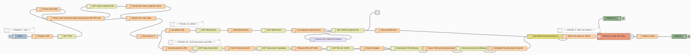</a>
<em>The PLM flow extracts data from a PLM system, creates an AAS and writes the data to the corresponding submodel</em>

The second tab of the same file is entered once per position of the bill of
material, through a link node rather than through a wire, so that the two passes
stay legible side by side. It repeats the document chain for the individual
component and builds a shell of its own for it. The part data it works on already
comes from the bill-of-material position, which is why this tab is the shorter of
the two.

<a href="docs/img/Flow_PLM_part.svg">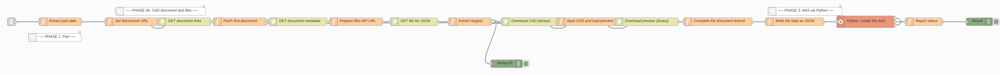</a>
<em>The second pass of the PLM flow, entered once per component</em>

The flow `Odoo_ERP.json` provides the functionality to retrieve product,
bill-of-material and order data from the ERP system and to write them into the
AAS as the data source `ERP`. All addresses and credentials are read from
environment variables and are deliberately not stored in the flow, so that a
flow exported from one installation and imported into another carries none of
them with it.

The flow authenticates against the JSON-RPC endpoint and searches for the bill of
material of the configured product. The product is found by name, by article
number or by part of the name, so that the search works whether the
configuration holds the designation or the number. The positions of the bill of
material are then read, followed by the product templates and the product
variants of every position. Flow uuid and weight are taken from the template and
overridden by the variant wherever the variant carries a value of its own; the
total mass of a position is the weight per piece multiplied by the quantity.
Positions without a flow uuid or without a valid weight are skipped and named
rather than silently omitted.

Finally the flow asks for the open manufacturing order over the product and
writes the result into the `DataSources` submodel: positions, quantities,
materials, process assignment and the order. When it rebuilds its own block it
carries over the entries that do not belong to it: the assembly records that
another flow keeps in the same place would otherwise be lost, and nothing would
report the loss.

<a href="docs/img/Flow_Odoo_ERP.svg">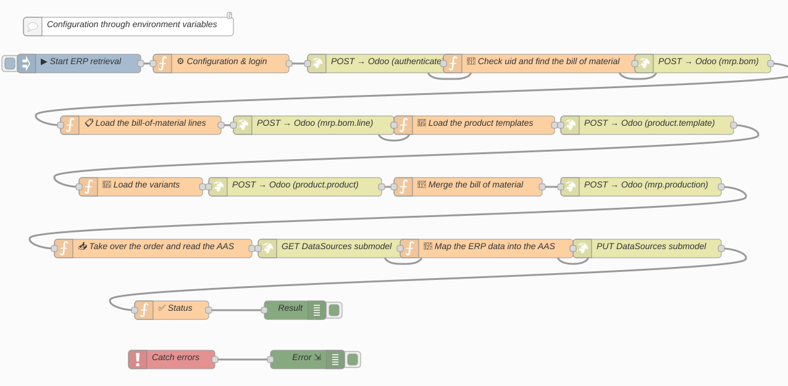</a>
<em>The ERP flow reads the bill of material, the quantities and the manufacturing order from Odoo and writes them into the AAS</em>

The flow `EMA.json` provides the functionality to read an export of the ema
Plant Designer and to integrate the simulated production sequence into the AAS as
the data source `Simulation`. A simulation results file is provided as part of
the sample data.

The flow is started manually via an inject node and hands the export to
`ema_export_to_json.py`, which reads the spreadsheet and returns the operations
as JSON. Keeping the spreadsheet outside the flow is deliberate: the export
format of the simulation changes independently of the workflow, and a Node-RED
node that parses spreadsheets would tie the two to one another. Each operation
carries its number, its name, the workstation, the cycle time, the processing
time and the energy per unit.

The operations are then assigned to the openLCA processes they act on. In the
reference product the simulation covers the assembly, that is the robot arm
placing the parts and the final inspection, so its energy belongs in full to the
assembly
process of the pen, while the energy of manufacturing the individual parts is
measured at the machines instead. The assignment is held in one place in the flow
and is the only thing that has to be adjusted when the production sequence
changes. The result is written into the `DataSources` submodel over the REST
interface of the AAS server.

<a href="docs/img/Flow_ema_simulation.svg">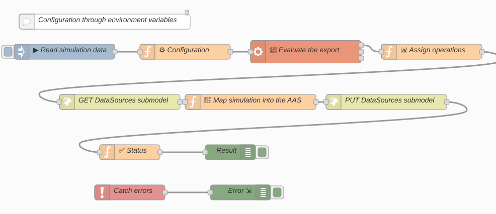</a>
<em>The ema flow reads the simulation export and writes the operations into the AAS as the data source Simulation</em>

The flow `OPCUA_Manufacturing.json` provides the functionality to turn
recorded machine measurements into the energy per piece and to write it into the
shell of the part that was produced, as the data source `MachineData`.

The measurements are read from the submodel that the OPC UA connection fills.
Every collection carrying a power reading is treated as a machine; the entries
are searched for rather than addressed by position, because the layout of that
submodel may change. The energy per piece follows from the average power
multiplied by the process duration, divided by one million and by the number of
pieces of the run. A machine without an entry in the assignment is skipped and
named. The robot arm and the transport system belong to the assembly, whose
energy comes from the simulation, and recording it here as well would count it
twice.

The assignment states which machine produces which part and which openLCA
parameter the measured energy acts on. One machine can produce two different
parts: the lathe turns both the bolt and the sleeve, and the measurement carries
the part name in its identifier so that both can stand side by side instead of
the newer one replacing the older.

Where a booked assembly is available, the runs are given the serial number of the
piece they produced, taken from the assembly records in the shell of the
assembled product. Where it is not, the numbers are assigned by article and by
the order in which they were given out, and the entry says so: the origin of the
assignment stands beside it rather than being passed over in silence.

<a href="docs/img/Flow_machine_data.svg">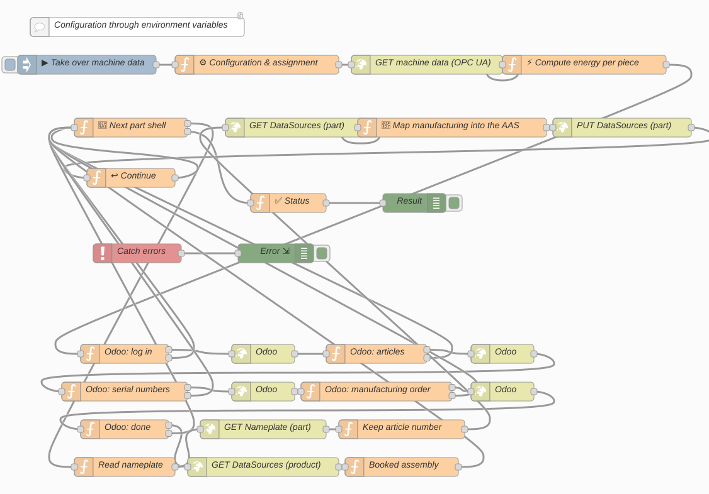</a>
<em>The machine flow forms the energy per piece from power and duration and writes it into the shell of the part that was produced</em>

The flow `OpenLCA_to_AAS.json` manages the configuration and initiation of
LCA calculations via the openLCA IPC interface and writes the results back into
the AAS. Unlike earlier versions the flow carries no operating elements of its
own: the shell, the impact method and the manufactured piece are selected in the
dashboard, and the flow reads that selection from the shared context.

The flow first reads the quantities and the process assignment from the
`DataSources` submodel of the product and adds the manufacturing energy of every
part from the shells of the parts. It then works through the selected impact
methods one after another. For each method it starts the calculation, waits until
the result is ready, requests the total impacts and releases the result again.
Where the method carries a normalisation and weighting set, the weighted single
score is formed from it; methods that carry none, EN 15804 among them, produce
no single score, and none is written rather than an empty one.

The total result is written into the `ILCD` submodel of the product as an
iteration named after the data sources that actually went into it, so that
results of differing data quality can stand side by side. The flow then asks
openLCA for the share of each part and writes it into the `ILCD` submodel of that
part. The source list of the product holds for a part only in part: machine data
always concerns one particular part, and where none was measured for it, the
machines are not named in its result even though they did go into the total.

<a href="docs/img/Flow_openLCA_calculation.svg">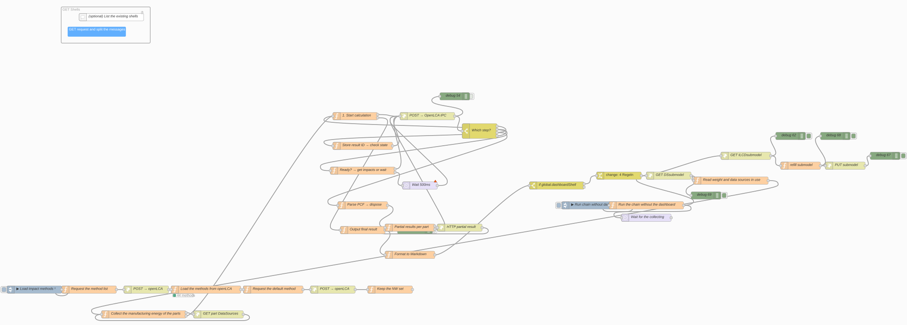</a>
<em>The openLCA flow collects the parameters, runs the calculation per impact method and writes the total and the share of each part back into the AAS</em>

The flow `Dashboard.json` provides the operating surface of the KIT at
`/dashboard/kit`. It brings its own dashboard configuration with it, so importing
the file is enough.

One button runs the whole chain. The steps are worked through one after another,
in the order ERP, simulation, machine data, calculation, because the calculation
needs the
quantities from the ERP and the energies from the other two. After each step the
dashboard reads the shell back and checks whether the data was written after the
run started; data that was already there does not count as a success. A step that
delivers nothing stops the run rather than calculating on incomplete data. The
machine data is the exception: nothing is manufactured on a purchased part, so a
missing measurement is noted and the run carries on without it, and the closing
message states which source was left out.

The page shows the footprint with its reference quantity, the state of every data
source together with the shell it came from, the result broken down by part, and
the machine runs that produced the parts of the selected piece. A dropdown
selects one manufactured piece: a product passport applies to a piece and not to
a type, and the machine table then shows only the runs that belong to it.

<a href="docs/img/Flow_dashboard.svg"></a>
<em>The dashboard runs the chain, checks every step and shows the result with the state of each data source</em>

The flow `Assembly_Booking.json` books one assembled piece in Odoo and
records in the shell which piece was built from which pieces. Without it a
footprint remains a statement about a type.

The flow creates a manufacturing order over exactly one piece, since a serial
number names exactly one piece. It confirms the order and has Odoo produce the
serial number of the assembled product from the number sequence configured for
the article. Composing the number inside the flow would be a second route beside
Odoo's own, and two routes drift apart. For every component under serial tracking
the flow then draws a number of its own and assembles it from the article of the
assembled product, its instance, the article of the component and the counter of
that component. Purchased parts stay without a number: that is not an omission
but the truth, since they are not manufactured here.

What is booked gets written, and only that. If Odoo refuses to close the order,
the flow reports it and carries on: the assignment is then in the shell, the
closing is not, and both are visible.

<a href="docs/img/Flow_assembly_booking.svg">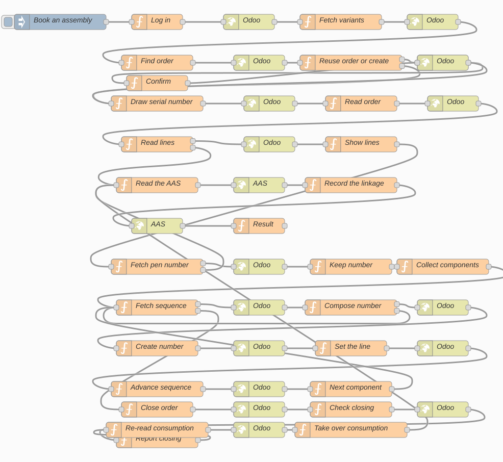</a>
<em>The booking flow creates the manufacturing order, draws the serial numbers and records the linkage in the shell</em>

The flow `Assembly_Backfill.json` reads every completed manufacturing order
from Odoo and restores the assembly records in the shell. It is needed after the
ERP block was rebuilt or a shell was recreated. The bookings still exist in
Odoo, but the record of them in the shell does not.

<a href="docs/img/Flow_assembly_backfill.svg">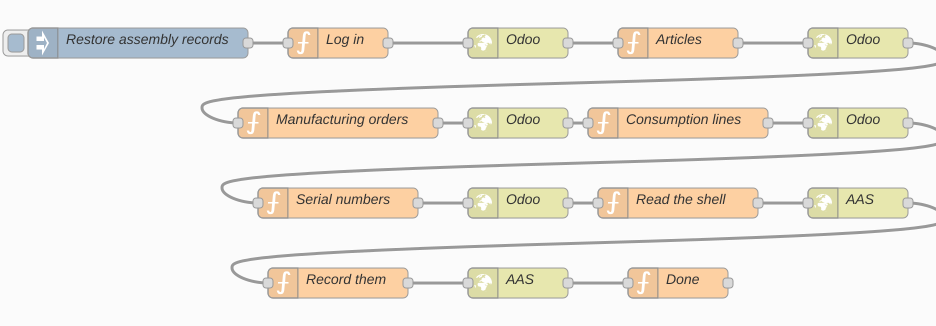</a>
<em>The backfill flow restores the assembly records from completed manufacturing orders</em>

### Interfaces and the dataspace

All interfaces of the KIT rest on dataspace technologies. Data is held in Asset
Administration Shells and addressed through the AAS API of CX-0002; identifiers
and the shell structure follow the Industry Core; the exchange with other
participants runs through an EDC connector as specified in CX-0018. The
connector is not an optional add-on at the edge of the architecture but the
component through which use cases 4 and 5 exist at all: without it the KIT
consolidates sustainability data inside one organisation, with it the same data
becomes available to customers, OEMs and downstream passport scenarios under
the participant's own policies.

Within one organisation the KIT reads from PLM, ERP, simulation and machines
through the interfaces those systems offer: REST, JSON-RPC, OPC UA and file
export. These are not dataspace interfaces and are not meant to be: they are the
inbound edge. Everything the KIT produces from them is written into the AAS and
is from that point on exchangeable through the connector.

## Sequence View


<em>Generic sequnce diagram of the DMT interacting with a third-party system</em>

The figure below shows the sequence diagram of the SDI-KIT. As the SDI-KIT provides a UI, the process starts with user input. The user chooses the asset that is to be processed from a list of the available assets on the AAS server via the UI. The data management tool (DMT) calls the asset’s AAS via REST API and displays it to the user in the UI. Next the DMT calls the third-party tool. In the diagram, a bidirectional API call is displayed. However, data from a third-party system can also be retrieved by OPC UA or a file upload, as described in Use case 2, Use case 3 and in Use case 4. The DMT maps the retrieved data and maps it to the correct submodels and properties in the AAS. The updated AAS is displayed in the UI. Next, the sustainability calculation starts. The DMT reads the AAS and retrieves all available data relevant to the sustainabilty caculation. The data is then passed on to the calculation tool. The calculation tool returns the results which are then written to the AAS. Optionally, the data can also be written back to update the third-party system. Results are displayed in the UI.
Depending on the number of data souces and third-party systems, the entire process can be interated several times. A higher number of data sources improves the data quality and therefore the result of the sustainability calculation. In this regard, the EDC Connector is to be treated as a data source or third-party system as it introduces new data for sustainability calculations into the system.

**Which use case the diagram shows.** The sequence above is generic: it holds
for every third-party system and is therefore drawn once rather than five times.
Use cases 1 to 3 differ only in which system is called and which data source is
written: PLM in use case 1, the simulation export in use case 2, ERP and the
OPC UA submodel in use case 3. Use cases 4 and 5 are not part of this diagram,
because they do not run against a third-party system but against the connector;
they start where this sequence ends, with data already in the AAS.

**Choice of assessment method.** The calculation step is not bound to one
method. Before the calculation the DMT queries the calculation tool for the
impact assessment methods it holds and offers them for selection; the reference
installation offers 44 and uses EF 3.0 unless another one is chosen. The method
travels with the result: each iteration in the `ILCD` submodel records the
method it was calculated with, next to the data sources it used. Two iterations
of the same product can therefore differ in data quality, in method, or in both,
and remain comparable because both are documented.

## API Documentation

The reference implementation does not provide an API. Data can be transferred externally via the data room using the EDC connector. 

### API documentation of used APIs within the system

| Component | API documentation |
| --- | --- |
| AAS Server | Specification of the Asset Administration Shell, Part 2: Application Programming Interfaces, 01002-3-0, https://app.swaggerhub.com/apis/Plattform_i40/AssetAdministrationShellRepositoryServiceSpecification/V3.0.3_SSP-001#/ |
| EDC Connector | EDC Connector provided by Smart Systems Hub, https://smart-systems-hub.github.io/docs/docs/tractus-x-edc-connector |

The API documentation of third-party systems depends on the individually selected system and is therefore not included here.

## Sample Data: TRACEpen

Sample files are provided to assist with the use of the reference implementation. These are listed in Table 1 below. Data is provided in several different formats. The reason for this is that the reference implementation is designed to utilise data from various formats in order to obtain sustainability data of the highest possible quality. 
AAS data is provided in both AASX and JSON formats. The JSON format can also be viewed without an AASX viewer. These files provide the structure, the necessary sub-models and sample asset data for the case study. To use them, the AAS file must be uploaded to the BaSyx server so that it can be accessed via the reference implementation using the AAS API.
An export file of a production simulation from the ema plant Designer by imk Industrial is also provided. This contains the results of the simulation for the case study. The ema Software Suite is not open source but is not required for this application. The export file is in xlsx format and can be opened with Excel. To use it, the path to the ema export file must be entered in the reference implementation. Corresponding Submodel Collections (SMC) are created in the appropriate submodel within the AAS, and the data is imported from the ema export file into the AAS.

Sample data provided to test the SDI-KIT, by file:

| Path under `docs/sample_data/` | Contents |
| --- | --- |
| `AASX/TRACEpen_Kugelschreiber/` | Seven packages - the pen and its six parts - as the PLM connection produces them. This folder is what `run_chain.py --import-dir` loads into the AAS server. |
| `AASX/BaseShell_Template.aasx` | The empty template shell the PLM connection fills: one shell with the seven submodels named below, all values blank. Anyone writing their own shell-building script needs this as the target structure. It carries no product data and no attached files. |
| `AASX/Submodel_DataSources_Template.aasx`, `.json` | The custom `DataSources` submodel on its own, as a template. Useful for anyone building the structure without running the PLM flow. |
| `AASX/Submodel_DataSources_ERP_Template.json` | The ERP part of that structure, with the bill of material and the manufacturing order. |
| `AASX/Submodel_ILCD_Template.aasx`, `.json` | The custom `ILCD` submodel, likewise as a template. |
| `ema_plantsimulation_data.xlsx` | Export of the production simulation, scenario E8. The path to this file is what the simulation flow reads. |
| `BOM_TRACEpen.csv`, `.xlsx` | The bill of material from the PLM. `setup-odoo.ps1` reads the CSV; the spreadsheet is the same data for reading by hand. |
| `Kugelschreiber_v002.STEP` | Geometry of the product in a neutral format, readable without SolidWorks. |
| `Kugelschreiber_v002.SLDASM` | The same assembly in the native format. The packages above carry it as an attachment as well, so this copy is for opening directly. |

There is no sample file from an ERP system. The ERP data is not exchanged as a
file in this KIT: `Odoo_ERP.json` reads it through the JSON-RPC interface of
the running system, and `setup-odoo.ps1` creates the records it needs from the
bill of material above.

## Demonstrator Implementation in the Laboratory


<em>Architecture overview of the demonstrator implementation</em>

The reference implementation was developed and implemented at the Smart Automation Lab at the Heinz Nixdorf Institute. The software was implemented using the low-code platform Node-Red. Node-Red is used to create flows that enable the necessary data flows between external (software) systems and the AAS. The Node-Red code is provided in JSON format. Figure shows an architecture overview of the demonstrator implementation in a possible environment with the data space and a decision support, which is based on the data calculated and managed within the demonstrator system. Moreover, the MX-ports “Orion”, “Leo” and “Hercules” are marked. 


<em>Component diagram of the SDI-KIT, including third party software</em>

The architecture of the SDI-KIT reference implementation is structured around the data management tool, which is implemented using the low code plattform Node-Red. Most components are connected to the data management tool via a bidirectional REST API. This includes optional third-party systems such as the PLM system by Contact Software, openLCA and the ERP system ODOO, as well as necessary components such as the AAS Server and the EDC connector. Other components are unidirectional such as the OPC UA Servers that deliver real-time machine data via OPC UA and the ema Plant Simulation data, which needs to be exported from the ema software and imported into to data management tool via upload. The data management tool contains a user interface (UI). The EDC Connector takes a special role in the system as it connects the systeme to the data space, therefore enabling it to receive data from external sources. This is especially important since LCA results increase in quality as more high-quality data becomes available, eg through exchange with value chain partners.


<em>Sequence view of the SDI-KIT</em>

The figure below shows the sequence diagram of the SDI-KIT reference architecture. As the SDI-KIT provides a UI, the process starts with user input. The user chooses the asset that is to be processed from the PLM system by entering the PLM number into the UI. The PLM number can be retrieved by looking it up in the PLM system. The data management tool (DMT) calls this asset via REST API and receives all information on the asset as it is saved in the PLM system. Next, the DMT creates a type-AAS in the predefined configuration. More information on this configuration can be found in the AAS section. The previously retrieved asset data is now written in the AAS and displayed to the user via the UI. The DMT then reads the data from the AAS that is relevant to the sustainability calculation. In this case, openLCA is used for the calculation. The data is transferred to openLCA via API and used to calculate sustainability values. The results are returned to the DMT per REST API and the DMT updates the PLM system and the AAS and writes the data to the mapped submodel and properties. This concludes Use case 1 as an early-stage LCA based on PLM data. 

For the second iteration in **Use case 2**, the reference implementation enriches the AAS with simulation data. For the simulation, the ema Plant Designer is used to model and simulate the production process of the asset. The simulation calculates process times, energy and water consumption. The results can be exported as a .xlsx-file. This file is then uploaded into the DMT via the UI. The DMT then reads the relevant cells and creates the processes as submodel element collections and the corresponding simulation values as properties in the AAS. Afterwards the LCA sequence is run again to calculate updated sustainability values. 

For the third iteration in **Use case 3**, production data is used. For this, the DMT is connected to the ERP system via REST API to retrieve order data and save it in the AAS. The data from the ERP system is nesseccary to calculate the correct number of each product for the order. As the production process is started, OPC UA servers installed on the maschines send live process data. The Open Platform Communication Unified Architecture (OPC UA) is a standardised communication protocol for internal factory data  [2].  The OPC UA servers at the systems are implemented using Raspberry Pis on the one hand and Shelly plugs (Shelly Plug S (230 V)) on the other. The Raspberry Pis record activity data from the systems, such as ‘door open’, ‘door closed’ or ‘robot active’. The Shellys are plugs that are connected between the device and the power source and record only the energy consumption. Data is received from the OPC UA servers of the individual production systems in the laboratory. On the one hand, this data is displayed in real time on a dashboard on the UI; on the other hand, the average of this data is calculated to store it in the AAS. Once the production process is finished, the LCA sequence is started. 

On the fourth iteration, the DMT connects to the EDC Connector via REST API. The ECD Connector then exchanges data via the data space with business partners. The exact workflow of the EDC Connector is documented in in the **Catena-X Standard CX-0018 Dataspace Connectivity v.4.2**. Functionally, the EDC Connector is treated as a data source, as it provides new data to the reference implementation system. Due to this, the data that is received via the data space is written to the AAS. Finally, the LCA sequence is carried out. This constitutes both **Use case 4** and Use case 5 as both use Cases can be executed using the EDC Connector. 

## AAS Data Model, Submodels and Custom Submodels

The Asset Administration Shell (AAS) for the asset is created via API. The AAS API documentation is standardised and is described in the AAS standard “01002-3-0 Part 2: Application Programming Interfaces” [3]. In the reference implementation presented in this KIT, the AAS is not created entirely automatically. First, a type-AAS must be created for the respective asset and stored in the system. On this basis, instance-AASs can be created automatically. Due to this constraint, a preconfigurated AAS is stored in the system. When a new AAS is created, it automatically contains the predefined structure presented in the following. The predefined AAS contains the submodels shown in Table. 

<em>Submodels of the preconfigurated AAS data model</em>

| Submodel name | Short name, Version | IDTA Number / Custom |
| --- | --- | --- |
| Digital Nameplate for industrial equipment | Nameplate V3.0 | 02006 |
| Generic Frame for Technical Data for Industrial Equipment in Manufacturing | TechnicalData V2.0 | 02003 |
| Creation and classification of materials in an ERP, PDM/PLM and PIM system | BackendSpecificMaterialInformation | 02034 |
| Handover Documentation | HandoverDocumentation V2.0 | 02004 |
| Provision of 3D Models | Models3D V1.0 | 02026 |
| Data Sources for recorded and simulated production data | DataSources | custom |
| ILCD-based LCA data | ILCD | custom |

The master data, which is the same for every asset, is automatically transferred from the PLM system to each AAS instance via the REST API. The same applies to other data relating to the asset type, such as simulation results, CAD models, technical data, material information and provided documents. The submodels receiving different data for each individual instance are the Submodel Collection (SMC) “MachineData” from the custom submodel “Data Sources”, which stores the production data send by the OPC UA servers, and “ILCD” in case data from the SMC “MachineData” was used to run an LCA. In case each instance is marked, for example with a QR-code, the marking may also change per instance and is stored in “Nameplate” in the Submodel Element List (SML) “Markings”. 


<em>Diagram of the custom submodel "Data Sources" to store process data</em>

The custom submodel “Data Sources” is shown in Figure. It has the purpose to store both production data and simulation data in a process specific way. That means that data from a single process receives its own Submodel Element Collection, ensuring that process specific data does not get mixed up. It also allows the calculation of the environmental impact of a single process rather than the entire production line. The simulation result file is structured in a way that it delivers data per process. Therefore, it is beneficial to sort it into the process specific structure as well.


<em>Diagram of the custom submodel "ILCD" to store LCA data from different iteration</em>

## Data Sources and Their Effect on the Assessment

This chapter describes which data source feeds which part of the calculation and what happens when an additional source becomes available. It is the implementation of the central claim of this KIT: better data leads to more reliable results, without losing the earlier ones.

### Division by origin

| Data source | provides | target in openLCA |
| --- | --- | --- |
| **PLM** | product weight, material | baseline; quantities where no ERP data exists |
| **ERP** (Odoo) | bill of material with masses per part, order quantity | mass parameters `Menge_*` of the part processes |
| **Simulation** (ema Plant Designer) | energy demand of the assembly | `Energieverbrauch_Montage_Kugelschreiber` of the assembly process |
| **MachineData** (machine data, OPC UA) | measured energy demand of part production | `Energieverbrauch_Bolzen`, `_Huelse`, `_Stiftspitze` |

The division follows how the product is actually made:

- The **assembly**, meaning robot handling and final inspection, is simulated. Its energy demand belongs to the assembly process of the finished product.
- **Bolt, sleeve and pen tip** are manufactured in house. Their energy demand is measured at the machines and fed in through the `MachineData` data source.
- **Refill, spring and screw** are purchased parts. They carry no energy demand of their own for now; the fields stay empty and can later be filled with supplier data.

### Precedence

The parameter assembly in `OpenLCA_to_AAS.json` treats masses and energy separately and takes the best available source for each:

```
Masses : MachineData → ERP → PLM
Energy : MachineData → Simulation
```

The first source that carries the matching container wins. A better source therefore displaces a weaker one without affecting the other group. The log states where each group came from:

```
Data sources: Simulation, PLM, ERP
Masses from ERP, energy from Simulation | 15 parameters
```

Where several entries point at the same openLCA parameter, for instance all five simulated operations pointing at the assembly energy, their amounts are added rather than overwriting one another.

### Storage in the AAS

Each data source is a SubmodelElementCollection under `DataSources → DataSources`:

```
ERP                          Simulation
├── DataSource = "ERP"      ├── DataSource = "Simulation"
├── SourceSystem = "Odoo"        ├── SourceSystem = "ema Plant Designer"
├── TimeOfRetrieval              ├── TimeOfSimulation
├── ProductName, ProductCode     ├── Scenario, ExportFile
├── BillOfMaterial               ├── TotalEnergyPerUnit + Unit
│   └── <part>                   └── SimulationProcesses
│       ├── TotalMass + Unit         └── <operation>
│       ├── Material                     ├── OperationNumber, OperationName
│       ├── LCAProcessId                 ├── WorkStation
│       ├── LCAParameterName             ├── CycleTime + Unit
│       └── LCAZeroParameters            ├── ProcessDuration + Unit
└── ManufacturingOrder                   ├── EnergyPerUnit + Unit
                                         ├── LCAProcessId
                                         └── LCAParameterName
```

Measured machine data is stored in the AAS of the part that was produced, not in the product AAS:

```
MachineData                    (in the AAS of the part)
├── DataSource = "MachineData"
├── SourceSystem = "OPC UA"
├── TimeManufacturingStart / TimeManufacturingEnd
├── TotalEnergyPerUnit + Unit
└── ManufacturingProcesses
    └── <machine>
        ├── AveragePower + Unit
        ├── ProcessDuration + Unit
        ├── PieceCount
        ├── EnergyPerUnit + Unit
        ├── LCAProcessId
        └── LCAParameterName
```

Each part is therefore a digital twin in its own right and can be reused independently. The calculation flow collects the energy across the part AAS instances, finding them from the component names in the bill of material.

### Three entries per value

For a value to enter the calculation it needs two references besides the number itself:

| Property | Meaning |
| --- | --- |
| `LCAProcessId` | identifier of the openLCA process in which the parameter is defined |
| `LCAParameterName` | name of the parameter to set |
| `LCAZeroParameters` | further parameters of the same process that must be set to zero |

`LCAZeroParameters` is needed because the part processes are modelled as templates: they carry several materials at once so that the material of a part can be changed without touching the model. The material that does not apply therefore has to be set to zero explicitly on every calculation.

Entries without these references are skipped and named in the log. Purchased parts without energy data stay visible without blocking the calculation.

### Effect on the result

Measured for the TRACEpen with the sample data, impact method EF 3.0:

| Data situation | GWP 100a | change |
| --- | --- | --- |
| masses only (ERP + PLM) | 0.121508 kg CO₂eq | baseline |
| plus assembly energy (simulation) | 0.123143 kg CO₂eq | +1.35 % |
| plus manufacturing energy (machine data) | 0.293292 kg CO₂eq | +138.17 % |

The manufacturing energy more than doubles the footprint. Without it the assessment understates the product by more than half, which is precisely why the stepwise enrichment described here matters.

### Prerequisites in the openLCA model

Two conditions have to hold for the values passed in to take effect. Neither produces a warning in openLCA.

1. **The reference amount of every part process is 1 p.** Otherwise openLCA scales the process by the reciprocal of that amount; a reference of 0.003 kg means a factor of 333.
2. **Every input flow used has a provider in the product system.** An unlinked input is silently calculated as zero, regardless of the parameter value passed in.

#### Data sources are independent of one another

The chain is built for a rollout that happens in stages. In the ideal case PLM
comes first, then simulation, then the ERP system, then the machine data. But
months can pass between two of them, and some organisations will never connect
one of them at all. None of that breaks the assessment.

Every flow writes its own data source into the `DataSources` submodel and reads
none of the others. The calculation takes whatever is there at the time and
records in the result which sources it used. Verified for every combination:

| Sources present | Result |
| --- | --- |
| none | calculation runs on the default values of the LCA model |
| PLM only | as above; the sample PLM export carries a product weight, not a bill of material |
| simulation only | assembly energy measured, masses from the model |
| ERP only | masses order-specific, energy from the model |
| ERP + simulation | masses and assembly energy from your data |
| all four | masses, assembly energy and measured manufacturing energy |

Where two sources could supply the same quantity, the more specific one wins:

```
Masses : MachineData → ERP → PLM
Energy : MachineData → Simulation
```

A source added later therefore displaces the weaker one without any change to
the configuration. Earlier results stay in the `ILCD` submodel as separate
iterations, so the effect of the new source is visible rather than silently
overwritten.

#### Connecting a different third-party system

Odoo, ema Plant Designer and CONTACT Elements are the systems of the reference
installation, not a requirement. The KIT is a reference implementation for
integrating sustainability data; the interface a source has to meet is the
submodel, not a particular product.

To connect a system of your own, write a `SubmodelElementCollection` into the
`DataSources` list of the product AAS, or of a part AAS for data that belongs
to a single part. Two shapes are understood:

**Quantities**: a `BillOfMaterial` list, one collection per component:

| Property | Meaning |
| --- | --- |
| `ComponentName` | name of the part; the part AAS is derived from it |
| `TotalMass` | mass in kg for the quantity in the bill of material |
| `LCAProcessId` | identifier of the process in openLCA |
| `LCAParameterName` | parameter in that process that receives the mass |
| `LCAZeroParameters` | parameters to set to zero, comma separated |

**Energy**: a list named `<something>Processes`, one collection per operation,
with `EnergyPerUnit` in MJ per piece plus the same `LCAProcessId` and
`LCAParameterName`.

Add a `DataSource` property holding the label to be shown in the result. That is
the whole contract. The existing flows are worth reading as worked examples:
`Odoo_ERP.json` for quantities, `EMA.json` and `OPCUA_Manufacturing.json` for
energy.

Where the source sits in the precedence lists above is decided in the node
*Gewicht + genutzte Datenquellen lesen* of `OpenLCA_to_AAS.json`, in the arrays
`MENGEN_QUELLEN` and the energy lookup below it.

## Data Mapping

This chapter documents how data from the connected source systems is mapped into the Asset Administration Shell. It is the technology-independent counterpart to the reference implementation: the mapping is described so that the KIT can be rebuilt with a different integration technology than Node-RED, which is a precondition for the flexibility the KIT claims.

The mapping is applied in four stages, corresponding to the use cases:

| Stage | Source | Target | Implemented in |
| --- | --- | --- | --- |
| 1 | PLM system (REST API) | intermediate JSON | `src/PLM.json` |
| 2 | intermediate JSON | AAS submodels (AASX) | `src/create_set_number_of_aas_instances.py` |
| 3 | Simulation export (`.xlsx`) | AAS submodel `DataSources` | `src/EMA.json` |
| 4 | LCA tool (openLCA IPC) | AAS submodel `ILCD` | `src/OpenLCA_to_AAS.json` |

Stages 1 and 2 together implement use case 1, stage 3 implements use case 2, and stage 4 is executed after each of them.

### Target Structure: Custom Submodels

Two custom submodels hold the data that no IDTA template covers.

**`DataSources`** stores process-specific input data, separated by origin so that values from different sources cannot be confused:

```
DataSources                                     [Submodel]
└── Data Sources                                [SubmodelElementList]
    ├── MachineData                           [SMC]   measured production data
    │   ├── ManufacturingProcesses             [SML]
    │   │   └── <process name>                  [SMC]   one per process
    │   ├── time_manufacturing_start            [Property, xs:dateTime]
    │   ├── time_manufacturing_end              [Property, xs:dateTime]
    │   └── manufacturing_duration              [Property, xs:time]
    └── Simulation                              [SMC]   simulated process data
        ├── time_of_simulation                  [Property, xs:dateTime]
        ├── export_file                         [File]
        └── Simulation_Processes                [SMC]
            └── <process name>                  [SMC]   one per process
```

**`ILCD`** stores one result set per assessment iteration, so that earlier results are preserved rather than overwritten:

```
ILCD                                            [Submodel]
└── LCAIteration                                [SubmodelElementList]
    └── <data source>                           [SMC]   e.g. "PLM", "Simulation"
        ├── DataSource                          [Property, xs:string]
        ├── TimeOfLCA                           [Property, xs:dateTime]
        ├── WeightOfPart                        [Property, xs:string]
        ├── TargetOutput                        [Property, xs:string]
        └── LCIAMethods                         [SubmodelElementList]
            └── <method name>                   [SMC]
                └── <impact category>           [SMC]
                    ├── Value                   [Property, xs:double]
                    └── Unit                    [Property, xs:string]
```

The `<data source>` collection is named after the origin of the input data. This is the mechanism by which the KIT preserves source attribution and allows different data-quality levels to coexist.

### Stage 1: PLM System → intermediate JSON

The PLM API is queried in three phases: part master data, bill of material, and CAD document with its files. Field names are those of the PLM system used in the reference implementation (CONTACT Software); adopters with a different PLM must substitute their own.

#### Part master data

| PLM field | Intermediate field | Note |
| --- | --- | --- |
| `benennung` | `name` | product designation |
| `teilenummer` | `articleNumber` | manufacturer part number |
| `materialnr_erp` | `erpNumber` | falls back to `articleNumber` if absent |
| `joined_status_name` | `status` | |
| `system:ui_link` | `uiLink` | deep link into the PLM system |
| `mengeneinheit_name` | `unit` | base unit of measure |
| `t_kategorie_name` | `category` | |
| `mapped_maturity_name` | `maturity` | |
| `cdb_cdate` | `createdAt` | truncated to the year for `YearOfConstruction` |
| `material_object_id` | `materialObjectId` | |
| `techdaten` | `techdaten` | composite field, see below |

The `techdaten` field is a comma-separated composite that is split into two values: the first element is the material ID, the second the part weight in kilograms. The material ID is resolved through a second API call to the material collection, which returns the material name.

| Derived value | Source | Type |
| --- | --- | --- |
| `partMaterialId` | `techdaten[0]` | string |
| `partWeight` | `techdaten[1]` | float, kg |
| `partMaterialName` | material API → `name` | string |

#### Bill of material

One entry per BOM position; the material of each position is resolved through the same material API.

| PLM field | Intermediate field |
| --- | --- |
| `position` or `lfd_nr` | `position` |
| `teilenummer` | `partNumber` |
| `benennung` | `name` |
| `menge` | `quantity` |
| `mengeneinheit` | `unit` |
| `baugruppenart` | `assemblyType` |
| `t_kategorie` | `category` |
| `techdaten[1]` | `weight` |
| material API → `name` | `material` |

### Stage 2: Intermediate JSON → AAS Submodels

The intermediate JSON is written into a preconfigured type-AAS. Existing properties are updated in place; the submodel structure itself is not created dynamically.

| Submodel | Path / SMC | idShort | Source value |
| --- | --- | --- | --- |
| Nameplate (IDTA 02006) | (root) | `ManufacturerProductDesignation` | `part.name` (MLP, `de`) |
| Nameplate | (root) | `ProductArticleNumberOfManufacturer` | `part.articleNumber` |
| Nameplate | (root) | `SerialNumber` | derived: `<articleNumber>-00-000000-00` |
| Nameplate | (root) | `YearOfConstruction` | `part.createdAt` (first 4 characters) |
| Nameplate | (root) | `URIOfTheProduct` | `part.uiLink` |
| Nameplate | (root) | `ManufacturerProductFamily` | constant `Lehrstuhl-Produkte` (MLP, `de`) |
| BackendSpecificMaterialInformation (IDTA 02034) | `MaterialSystemProperties` | `MaterialType` | `partMaterialName` |
| BackendSpecificMaterialInformation | `MaterialSystemProperties` | `ProductName` | `part.name` (MLP, `en`) |
| BackendSpecificMaterialInformation | `MaterialSystemProperties` | `MaterialStatus` | `part.status` |
| BackendSpecificMaterialInformation | `MaterialSystemProperties` | `BaseUnitOfMeasure` | `part.unit` (MLP, `en`) |
| BackendSpecificMaterialInformation | `MaterialSystemProperties` | `MaterialNumber` | `part.materialObjectId` |
| BackendSpecificMaterialInformation | `MaterialSystemProperties` | `Description` | derived: `<name> - <category>` (MLP, `en`) |
| Models3D (IDTA 02026) | (root) | `FileName` | CAD file name |
| Models3D | (root) | `FileVersionId` | `docData.fileVersion` |
| Models3D | (root) | `SetDate` | date of execution |
| Models3D | (root) | `StatusValue` | constant `released` |
| Models3D | `FileFormat` | `FormatName`, `FormatVersion` | `docData.fileClassification`, split at `:` |
| Models3D | `SoftwareApplication` | `ApplicationName`, `ApplicationVersion` | `docData.consumingApp`, split at first space |
| HandoverDocumentation (IDTA 02004) | `DocumentVersion_de` | `Title`, `DigitalFile` | BOM CSV `BOM_<articleNumber>.csv`, MIME `text/csv` |
| HandoverDocumentation | `DocumentVersion_file` | `Title`, `DigitalFile`, `PreviewFile` | CAD file and preview image |
| HandoverDocumentation | `DocumentVersion_*` | `OrganizationOfficialName`, `OrganizationShortName` | constants |
| HandoverDocumentation | `DocumentId` | `DocumentIdentifier`, `DocumentDomainId` | `BOM_<articleNumber>`, `CIM-Database` |
| DataSources (custom) | `PLM` | `Material` | `partMaterialName` |
| DataSources (custom) | `PLM` | `Weight` | `partWeight` (kg) |

The bill of material is not written into the AAS as submodel elements. It is exported as a CSV file and attached as a document through `HandoverDocumentation`.

Identifiers are normalised before use: umlauts are transliterated (`ä`→`ae`), all remaining characters outside `[A-Za-z0-9_]` become underscores, and a leading digit is prefixed with an underscore, in accordance with AAS constraint AASd-002.

### Stage 3: Simulation Export → `DataSources`

The simulation export is read per row; each row is one work station. Rows without a work station name are discarded.

| Column in the export | Target idShort | Type | Location |
| --- | --- | --- | --- |
| `Arbeitsplatz` | *(becomes the SMC name)* | (dynamic) | `Simulation_Processes/<process>` |
| `Verbrauch, Strom` | `Verbrauch_Strom` | `xs:float` | `Simulation_Processes/<process>` |
| `Verbrauch, Wasser` | `Verbrauch_Wasser` | `xs:float` | `Simulation_Processes/<process>` |

Two further values are written alongside the process collections:

| Value | Target idShort | Type |
| --- | --- | --- |
| Timestamp of the simulation run | `time_of_simulation` | `xs:dateTime` |
| Reference to the embedded export file | `export_file` | File, `/aasx/files/<filename>` |

Decimal values are normalised from comma to point notation before conversion. Work station names are converted to valid idShorts using the same rules as in stage 2, with the prefix `AP_` if the name does not start with a letter.

Process data is deliberately stored per process rather than aggregated for the whole production line. This allows the environmental impact of a single process to be calculated and compared, which is the basis for the hotspot analysis in the decision-support dashboards.

### Stage 4: LCA Results → `ILCD`

The calculation tool is called per impact assessment method; the results of all selected methods are collected and written into the AAS in a single operation.

| Result field | Target idShort | Type | Note |
| --- | --- | --- | --- |
| origin of the input data | `DataSource` | `xs:string` | also becomes the name of the iteration SMC |
| `calculatedAt` | `TimeOfLCA` | `xs:dateTime` | timestamp of the calculation |
| part weight read back from the AAS | `WeightOfPart` | `xs:string` | |
| `targetOutput` | `TargetOutput` | `xs:string` | reference quantity of the assessment |
| `impactMethodName` | *(becomes the SMC name under `LCIAMethods`)* | (dynamic) | one collection per method |
| `impactCategory.name` | *(becomes the SMC name)* | (dynamic) | one collection per impact category |
| `amount` | `Value` | `xs:double` | |
| `impactCategory.refUnit` | `Unit` | `xs:string` | unit as reported by the calculation tool |

Because every run creates a new iteration collection named after its data source, results from PLM-based, simulation-based and production-data-based assessments coexist in the same submodel and remain individually traceable.

### Rebuilding the Mapping with Other Technologies

The mapping above is independent of Node-RED. An implementation with a different integration technology has to provide four capabilities:

1. **Read** the source system through its API or file export and normalise the values (decimal separator, units, encoding).
2. **Normalise identifiers** to AAS constraint AASd-002 before using them as idShorts.
3. **Write** into an existing submodel structure by idShort, creating collections only where the structure is repeating (one per process, one per method, one per impact category).
4. **Preserve source attribution** by naming the iteration collection after the origin of the input data, and never overwrite an existing iteration.

## PLM Connection (CONTACT Elements)

The PLM system holds the product baseline: the part, its bill of material, the
material and weight of every component, and the CAD document. This is the
earliest point at which an assessment is possible, long before an order exists
in the ERP system or a machine has produced anything.

`src/PLM.json` implements this step against a CONTACT Elements installation. It
is a reference implementation: the interface the KIT depends on is the
Asset Administration Shell it produces, not the PLM product. For a different
system, the read side is replaced and the write side stays as it is.

### What the flow does

The flow works through the product and its components in two passes. The first
tab handles the product, the second is entered once per component.

| Step | Reads | Result |
| --- | --- | --- |
| Part | `/api/v1/collection/part/<article number>` | name, article number, status, unit, category, `techdaten` |
| Material | `/api/v1/collection/material/<id>` | material name, resolved from `techdaten` |
| Bill of material | the `targets` of the part's BOM link | one entry per position |
| Position | `/api/v1/collection/bom_item/<id>` | quantity, unit, weight, material |
| Documents | the document link of the part | metadata of the first document |
| Files | the file list of the document | CAD file and preview image |
| Shell | (nothing) | AASX package per part, built by an external script |

The collected data is written to a JSON file and handed to the script named in
`SDI_PLM_SCRIPT`. That script builds the AASX package from a template shell.

### Configuration

| Variable | Meaning |
| --- | --- |
| `SDI_PLM_URL` | bare server address; a trailing `/odoo` or `/web` style path is removed |
| `SDI_PLM_USER` | login name |
| `SDI_PLM_PASSWORD` | leave empty in `.env`; `start-nodered.ps1` asks for it and passes it to the process only |
| `SDI_PLM_WORK_DIR` | directory for the intermediate files (JSON, CAD, preview) |
| `SDI_PLM_BASE_SHELL` | template of the administration shell |
| `SDI_PLM_OUTPUT` | directory the finished packages are written to |
| `SDI_PLM_SCRIPT` | script that builds the shell from the collected data |

Paths may be written relative to `getting-started/`; the start script resolves
them. Node-RED itself runs with its own working directory, so an unresolved
relative path would silently read nothing.

Authentication is HTTP basic and is built from the two variables for every
request. It is deliberately not stored in the flow: a flow exported from one
Node-RED and imported into another carries no credentials with it.

### The shell-building script

The script is **not** part of this repository. It depends on the object model of
your PLM system and on the submodel template you want to fill, so it has to be
written for your installation. The interface is small:

```
script <path to the JSON file>
```

The JSON contains `part`, `bomItems`, `docData`, the paths of the downloaded CAD
and preview files, and the paths of the template and output directory. The
script writes an AASX package and reports its result on standard output.

The **template shell is provided**:
`docs/sample_data/AASX/BaseShell_Template.aasx`. It is the structure your
script has to fill, with every value emptied, so it can be opened in any AAS
viewer and read off directly.

In the reference installation the template shell carries seven submodels:
`Nameplate`, `TechnicalData`, `HandoverDocumentation`, `Models3D`,
`BackendSpecificMaterialInformation`, `DataSources` and `ILCD`. The last two are
the ones the rest of the KIT works with; the others carry the engineering
context.

### Behaviour worth knowing

**Requests are sent one per second.** The PLM system of the reference
installation does not answer the bill-of-material material lookups when they
arrive in parallel. A rate limit node between the lookup and the request keeps
them sequential. For six positions this costs six seconds; for a large bill of
material it is what keeps the run from being refused altogether.

**Purchased parts without CAD still produce a shell.** A part without a document
is not an error. The flow skips the document chain and builds a shell without a
model file. In the reference product this applies to the compression spring.

**Every request builds its own headers.** After an HTTP node, `msg.headers`
holds the headers of the *response*. Carrying them into the next request sends
the previous `content-length` along, and the server then waits for a body that
never arrives, visible only as a timeout two minutes later.

### From the packages to the assessment

The generated packages are imported into the AAS server. Two things regularly
get in the way:

**Windows artefacts in the package.** If `Thumbs.db` or `.DS_Store` ends up in
an AASX file, the server rejects it with HTTP 400 and a message about a missing
content type. The repository ships the fix:

```bash
python src/repair_aasx.py <directory with the packages>
```

**The upload does not overwrite.** Importing a shell that already exists answers
HTTP 409. Delete the shell and its submodels first, and keep in mind that this
also removes the data other flows have already written into `DataSources` and
`ILCD`. Either import before the other sources run, or save those two submodels
beforehand and write them back afterwards.

Once the shells are in place, the other flows fill them. In the reference
installation the full chain over the PLM-generated shells gives the same result
as over the sample data shipped with the KIT:

```
PLM   7 shells, bill of material with 6 positions
ERP   6 positions, order over 25 pieces
Sim   5 operations, 0.014 MJ
OPC   bolt 0.4032 | sleeve 0.5772 | pen tip 0.4752 MJ
LCA   15 parameters, 28 impact categories, 0.293292 kg CO2 eq
```

## ERP Connection (Odoo)

The ERP connection implements use case 3 on the data side: order-specific and part-specific information from the ERP system is transferred into the Asset Administration Shell and becomes available to the sustainability calculation.

It builds on master's thesis MA 468 (Rajab, 2026), which coupled Odoo with openLCA. This KIT moves the connection into a Node-RED flow and writes the data into the AAS instead of back into Odoo.

| | Master's thesis MA 468 | SDI-KIT `Odoo_ERP.json` |
| --- | --- | --- |
| Goal | show sustainability values **in Odoo** | transfer ERP data **into the AAS** |
| Execution | Python script plus FastAPI microservice | Node-RED flow inside the data management tool |
| Odoo interface | XML-RPC | JSON-RPC, identical semantics, no extra packages |
| Data flow | Odoo → openLCA → Odoo | Odoo → AAS |
| Reused | data model, field names, variant and fallback logic | |

The additional fields that the thesis introduced to display results inside Odoo (`x_lca_gwp_per_kg`, `x_studio_lca_impact_tabelle` and `x_studio_total_co`) are deliberately **not** read. The KIT calculates the impacts itself from the AAS and takes only primary data from Odoo. The single exception is `x_studio_lca_flow_uuid`, because that identifier links a component to its dataset in the LCA database.

### Data sources in Odoo

| Odoo model | Used for |
| --- | --- |
| `mrp.bom` | bill of material of the product, reference quantity |
| `mrp.bom.line` | positions with quantity and unit of measure |
| `product.template` | designation, article number, weight, product category, flow UUID |
| `product.product` | variant; fallback for weight and flow UUID |
| `mrp.production` | manufacturing order with order quantity |

The variant and fallback logic follows chapter 5.3 of the thesis:

- **Flow UUID:** template preferred, variant as fallback
- **Weight:** template as the basis, variant overrides where maintained
- **Total mass:** weight per piece × quantity of the bill of material position

Positions without a flow UUID or without a valid weight are skipped and named in the log; the run does not abort because of them.

### Target structure in the AAS

The data is written as its own data source `ERP` into the `DataSources` submodel, alongside `MachineData`, `Simulation` and `PLM`:

```
DataSources                          [Submodel]
└── DataSources                      [SubmodelElementList]
    ├── MachineData                [SMC]
    ├── Simulation                   [SMC]
    ├── PLM       [SMC]
    └── ERP                      [SMC]
        ├── DataSource               [Property, xs:string]    = "ERP"
        ├── SourceSystem             [Property, xs:string]    = "Odoo"
        ├── TimeOfRetrieval          [Property, xs:dateTime]
        ├── ProductName              [Property, xs:string]
        ├── ProductCode              [Property, xs:string]
        ├── ProductWeight            [Property, xs:double]
        ├── ProductWeightUnit        [Property, xs:string]    = "kg"
        ├── BillOfMaterialId         [Property, xs:string]
        ├── BillOfMaterialQuantity   [Property, xs:double]
        ├── BillOfMaterial           [SMC]
        │   └── <component>          [SMC]   one per position
        │       ├── ComponentName    [Property, xs:string]
        │       ├── ProductCode      [Property, xs:string]
        │       ├── Quantity         [Property, xs:double]
        │       ├── QuantityUnit     [Property, xs:string]
        │       ├── WeightPerUnit    [Property, xs:double]
        │       ├── WeightUnit       [Property, xs:string]    = "kg"
        │       ├── TotalMass        [Property, xs:double]
        │       ├── TotalMassUnit    [Property, xs:string]    = "kg"
        │       ├── Material         [Property, xs:string]
        │       ├── MaterialCategory [Property, xs:string]
        │       ├── LCAFlowId        [Property, xs:string]
        │       ├── LCAProcessId     [Property, xs:string]
        │       ├── LCAParameterName [Property, xs:string]
        │       └── LCAZeroParameters[Property, xs:string]
        └── ManufacturingOrder       [SMC]   where an order exists
            ├── OrderNumber          [Property, xs:string]
            ├── OrderQuantity        [Property, xs:double]
            ├── OrderUnit            [Property, xs:string]
            └── OrderState           [Property, xs:string]
```

Three design decisions are worth explaining.

**`LCAProcessId` and `LCAParameterName` per component.** These carry the link between a stored value and the parameter it feeds in the LCA model. Without them the calculation would have to hold that mapping in code, which is exactly what this KIT sets out to avoid.

**Units as separate properties.** `WeightUnit`, `TotalMassUnit` and `ProductWeightUnit` are written alongside the numbers. A bare number is not usable for an assessment, and a later mapping onto CX-0136 requires the unit.

**The idShort is `ERP`, not `ERP`.** AAS constraint AASd-002 allows only `[a-zA-Z][a-zA-Z0-9_]*` for idShorts, so a hyphen is not permitted. The label `ERP` is stored as the value of the `DataSource` property and is used from there to name the LCA iteration in the `ILCD` submodel.

### Flow sequence

| # | Node | Task |
| --- | --- | --- |
| 1 | Configuration and login | read the environment variables, build the authentication call |
| 2 | POST → Odoo | authenticate, returns the `uid` |
| 3 | Check uid, search bill of material | find `mrp.bom` by product name, article number or partial name |
| 4–6 | POST → Odoo | load the header and the positions |
| 7–10 | POST → Odoo | load product templates and variants, each in a single batched call |
| 11 | Merge bill of material | apply the fallback logic, compute total masses |
| 12 | POST → Odoo | look for an open manufacturing order |
| 13 | Take order, read AAS | adopt the order data, load the `DataSources` submodel |
| 14 | Map into the AAS | build `ERP` and insert or replace it |
| 15 | PUT submodel | write the changed submodel back |
| 16 | Status | report the result, name the skipped positions |

Templates and variants are read in batches rather than one call per position. For six positions that is nine calls instead of the twenty-one a per-position loop would need.

### Setting up the sample data

`src/setup_odoo_testdata.py` creates the sample data in an Odoo instance. Its source is the PLM export `docs/sample_data/BOM_TRACEpen.csv`, so that Odoo, the AAS and the sample data carry the same article numbers, weights and materials.

The script creates the custom fields, the product categories, the seven products, the bill of material and a manufacturing order. It is repeatable and checks the stored weights as well as the uniqueness of the flow UUIDs at the end.

The mapping from component to LCA process is defined in the script and **has to be checked against your own openLCA database**.

### Experience from building the connection

Three points that arise in any ERP connection for an environmental assessment, recorded here because none of them produces an error message.

**Weights are silently rounded.** Odoo stores weights with two decimal places by default. Parts weighing a few grams therefore become 0.00 kg. The interface reports no error, the data looks complete, and the assessment consists mostly of zeros. In our test exactly one of six components survived. The decimal precision for *Stock Weight* has to be raised before the first data transfer; the setup script does this and reads the weights back for verification.

**Field names change between Odoo versions.** In Odoo 19 `uom_po_id` was removed from `product.template` and `product_uom_id` from `mrp.bom.line`, while `type` was replaced by `is_storable`. The flow therefore requests only the fields it actually needs and takes the unit of measure from the product rather than from the bill of material position. The setup script determines the available fields at runtime through `fields_get`.

**Stale values on renamed products.** If a product is updated by its article number and renamed in the process, fields that are not overwritten keep their previous content. In our test two components ended up with the same flow UUID, which would have calculated a stainless steel screw using the dataset of a spring. The setup script therefore always writes the UUID, even when empty, and checks for duplicates afterwards.

## Decision support for sustainable product engineering

Data collection and integration across various systems, such as LCA databases and PLM systems, was implemented in the laboratory demonstrator shown earlier. The process and product data consolidated through this implementation are used for a decision support tool. This decision support enables well-informed and targeted decisions in product engineering and is designed to empower engineers even in the early stages of the product design process through analysis and visualization of key data. As part of the decision-making process, particular emphasis is placed on sustainable product engineering, which involves integrating methods such as carbon footprint, water footprint, and effect chain analysis. The data is utilized within a knowledge graph. By designing a metadata model, the data is specifically contextualized and properly linked for analysis. Nodes and relationships were defined in advance and subsequently refined. The graph structure and metadata model are provided in JSON format. 

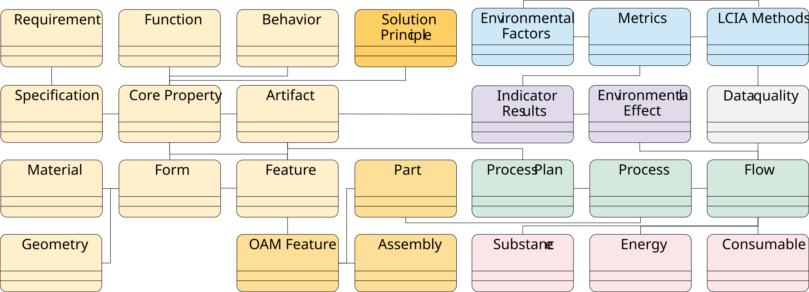
<em>Metadatamodel for the knowledge graph</em>

The knowledge graph was created using Neo4j. Neo4j is a graph database that stores data not in tables, but as nodes (entities) and edges (relationships). This makes it particularly well-suited for highly interconnected data, that can be analyzed and navigated directly along the relationships. The defined nodes and edges represent the structure of the knowledge graph. This graph still needs to be filled with data from the laboratory demonstrator or other data sources. Data is exchanged via the Asset Administration Shell (AAS) exchange format and through a system model of the product in a model-based systems engineering (MBSE) tool. The AAS contains sustainability metrics, product data, and material data. Requirements and functions can be derived from the system model. The interface between AAS and knowledge graph is provided.
Once the data is stored in the knowledge graph, the actual use and visualization of the data can take place. Dashboards are created in Neo4j for this purpose. The dashboards are populated using queries in the knowledge graph. Queries in Neo4j are written in Cypher. The results are displayed to the user on the dashboard, and the query runs in the background without the user seeing the code. This allows engineers without an IT background to interpret the knowledge graph using the dashboards and consult it when making decisions. The data is not lost but can be utilized in an integrated manner.

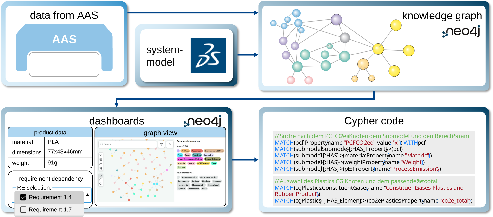
<em>Data implementation for decision support</em>

### Dashboards for decision support

Dashboards are visual overviews that summarize key metrics and data, for example, in charts or tables. They allow users to quickly grasp complex data sets and filter them interactively without having to write queries themselves. Depending on the use case, the role involved, and the method used, the sections of the dashboard look different. The graphic shows examples of various roles. The engineer receives a visualization of data quality to better assess the results of the carbon footprint and water footprint. The data analyst from the Data Science department evaluates data quality in their dashboard, which can then be displayed to the engineer. The different skills and responsibilities of these roles result in customized dashboards that meet their specific needs. The Cypher code for the dashboards is provided.

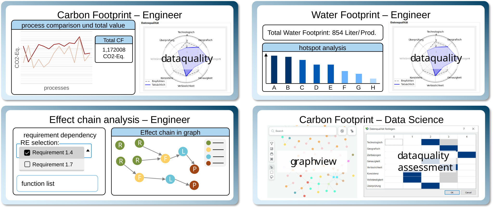
<em>Sample dashboards for different roles</em>

Engineers need product data, production data, and sustainability data to make decisions during product engineering. Key decision points during product creation are project release, concept release, design freeze, validation release, and production release. The data is constantly updated at every phase and used as a basis for decision-making. Depending on the specific use case, the dashboard contains different sections.

#### Viewing product data and comparing product variants

An engineer needs to get insights into the product data stored in the knowledge graph. The product data can refer to one or more variants. To display the data, the nodes of the relevant artifacts are queried for their stored properties. In this use case, the product data is retrieved from three different tables. The first table displays general product data from the properties. These properties include the product’s ID, name, description, type, manufacturer, version, and life cycle phase. The related Cypher query is:

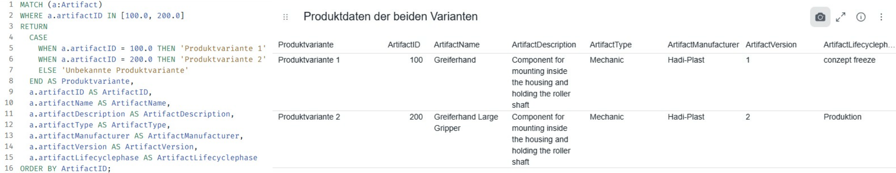

The second table displays the product's assemblies along with their corresponding parts to provide an overview of the product's structure. If there are two product variants, a separate table can be created for each variant. The corresponding Cypher query is:

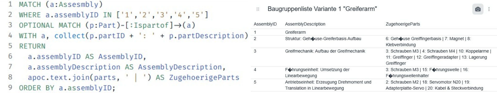

The third table includes sustainability information. Part of the product data is the percentage of recycled material used in the components. This information can be summarized in a table showing the variant, the artifact, the material, and the percentage of recycled material. The table can be supplemented with a bar chart, which makes the comparison of recycling rates easier to follow. The corresponding Cypher query is provided as a JSON format.

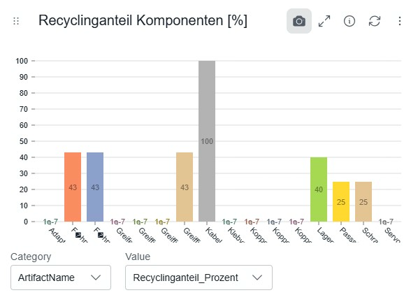

#### Calculation of environmental impacts

By building the knowledge graph based on the metadata model presented earlier, environmental impacts can be calculated. Since the knowledge graph contains both product information linked to related processes and sustainability methods with metrics and environmental effects, the environmental impacts applicable to the product can be calculated. To perform the calculation, the desired assessment method must be stored in the knowledge graph along with the metric’s calculation formula and the relevant environmental effects. In the implementation shown, the carbon footprint [kg CO2eq], water footprint [m3worldeq], and acidification [kgSO2eq] can be calculated. The environmental impacts are presented as single values. The different environmental impacts enable a flexible comparison to assess different environmental risks. The Cypher queries are provided as JSON format. An example is shown:

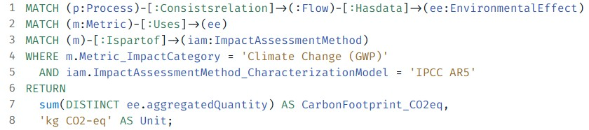

#### Displaying Hotspots

Based on the calculation of environmental impacts, hotspot analyses can be conducted. Hotspot analyses compare areas such as components, assemblies, or processes to identify where the highest environmental impacts occur. Based on these findings, measures can be planned and implemented to enable targeted improvements in environmental impacts at these hotspots. During implementation, the carbon footprint values of the assemblies are compared using a bar chart. This allows hotspots to be identified and potential measures to be developed. The intended Cypher query is part of the provided JSON format of the dashboard.

#### Analysis of Effect Chains

The effect chain analysis examines effects of requirements on other requirements and system elements. If a requirement is changed, other system elements must be adjusted accordingly based on those effects. The dependencies between requirements, specifications, functions, artifacts, and parts are modeled in the knowledge graph. In the dashboard, a requirement is selected using the select parameter type. Depending on the selection, the corresponding visualizations are displayed. A table displays all dependencies along with the corresponding descriptions of the selected requirement in text form. The next section shows the relevant close-up of the graph, making it possible to identify the dependent nodes through their relationships. The exact number of dependent functions, artifacts and so on, are shown as single values. All necessary Cypher queries are provided as JSON format. The graph close-up in the dashboard is shown as an example:

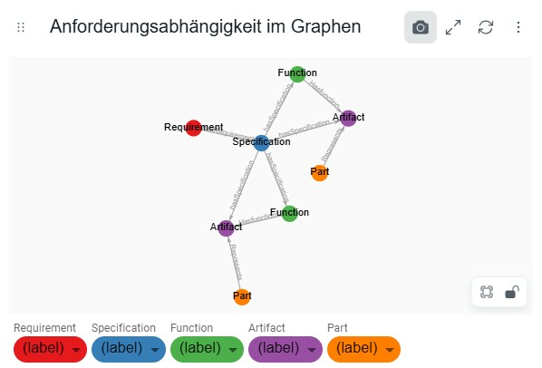

#### Assessment of Repairability

Repairability is assessed based on defined criteria, which are assigned weightings. The criteria include, for example, the effort required for disassembly, the cost and availability of replacement parts, documentation, and interfaces. The weighting is defined in advance and expressed as a percentage. The criteria are evaluated on a scale from 1 (especially low) to 10 (especially high). Once the engineer has evaluated and entered all criteria in the dashboard, the total score is calculated based on the weighting. The rating is multiplied by the weighting factor and then summed across all criteria. The total score is displayed as a single value.

### Sample Data: Gripper of a robotic arm

Sample files are provided to assist with the use of the knowledge graph. The exemplary product is a gripper of a robotic arm. All nodes, properties and relation of the knowledge graph are given in JSON format. This structure does not yet contain any product data. In Neo4j, a knowledge graph is populated with data using CSV files. The CSV files are uploaded to Neo4j and assigned to the nodes and relationships based on their labels. This allows the knowledge graph to be tested with the dashboards independently of the reference implementation of the data integration. To implement the knowledge graph, you can use Neo4j Aura (web version) or Neo4j (desktop version). After creating an instance, import the provided graph model. Then import the CSV files into the graph model. The dashboards for the knowledge graph are created in Neo4j’s NeoDash application. First, the dashboard must be connected to the knowledge graph. NeoDash uses the programming language Cypher to perform queries. The entire dashboard is available in JSON format and can be imported into NeoDash.

# Operations View

The Operations View addresses operators and service providers who deploy and run the SDI-KIT in their own environment. Following TRG 10.02, it covers non-functional requirements, security requirements, operational recommendations and restrictions.

The SDI-KIT is a **composition KIT**: it does not ship a single deployable product but orchestrates components that the adopter selects and operates (AAS server, LCA tool, EDC connector, source systems). The guidance below therefore distinguishes between the *data management tool (DMT)* delivered by this KIT and the *third-party components* around it.

### Deployment Baseline

The minimal workflow requires three components; everything else is optional and depends on which source systems the adopter integrates.

| Component | Role | Mandatory | Reference implementation |
| --- | --- | --- | --- |
| Data Management Tool (DMT) | Orchestrates data flows, mapping and UI | Yes | Node-RED |
| AAS server | Stores AAS, submodels and LCA results | Yes | Eclipse BaSyx |
| Sustainability calculation tool | Calculates environmental indicators | Yes | openLCA |
| Digital Twin Registry (DTR) | Makes twins discoverable in the dataspace | Only for dataspace operation | none yet, see Restrictions |
| EDC connector | Sovereign data exchange (use cases 4 and 5) | Only for dataspace operation | Tractus-X EDC |
| PLM system | Product master data, BOM, CAD properties | Optional | CONTACT Software |
| ERP system | Order-specific data, configuration, BOM | Optional | Odoo |
| Simulation tool | Process simulation data | Optional | ema Plant Designer |
| OPC UA servers | Live production measurements | Optional | Raspberry Pi, Shelly Plug S |
| Knowledge graph and dashboards | Decision support | Optional | Neo4j / NeoDash |

### Implementation Status

The published reference implementation does not yet cover all documented use cases. Operators should plan against the following status; the guidance in this Operations View is written for the complete scope and applies to the outstanding integrations once they are available.

| Integration | Use case | Status |
| --- | --- | --- |
| PLM → AAS | Use case 1 | Available (`src/PLM.json`), verified against CONTACT Elements |
| Simulation (ema) → AAS | Use case 2 | Available (`src/EMA.json`) |
| LCA calculation (openLCA) ↔ AAS | Use cases 1–5 | Available (`src/OpenLCA_to_AAS.json`) |
| Instance-AAS creation | Use case 3 | Available (`src/create_set_number_of_aas_instances.py`) |
| ERP → AAS | Use case 3 | Available (`src/Odoo_ERP.json`), verified against an Odoo instance |
| OPC UA → AAS | Use case 3 | Available (`src/OPCUA_Manufacturing.json`). The flow reads the submodel written by the OPC UA connection; the connection to the machines themselves is plant-specific and not part of the published sources. Each run is stored with its own identifier, time window, piece count and the serial number of the piece it produced. |
| Serial numbers and assembly booking | Use case 3 | Available (`src/Assembly_Booking.json`, `src/Assembly_Backfill.json`). Odoo issues the numbers from a configured pattern; the booking ties the components of an assembly to the piece and is written into `DataSources → ERP → AssemblyRecords`. |
| Operating interface | Use cases 1–3 | Available (`src/Dashboard.json`). One page for the run, the chosen piece, the state of every data source and the result split by part. |
| **EDC → AAS** | **Use cases 4 and 5** | **Planned, not yet implemented.** Dataspace exchange is delegated to the connector; the DMT-side integration flow is not published yet. |

Use cases 1 to 3 run end to end in the reference installation. Use cases 4 and 5 depend on the connector integration, which is not published yet.

Two things in the sequence view are worth reading against this table. It shows
`update PLM` at the end of use case 1, but the published flow reads from the PLM
and does not write back to it. And it shows `update ERP` in use case 3, which
does happen, but through the serial numbers and the assembly booking rather
than through a return of the assessment result.

One limitation of use case 1 is worth stating plainly: the PLM connection produces the administration shells including the bill of material, but it writes the product weight and material into the `PLM` data source, not a bill of material broken down by part. A calculation that runs on PLM data alone therefore uses the default masses of the LCA model for the individual parts. The order-specific masses enter with the ERP connection. Adopters whose PLM exports a bill of material can map it into the `BillOfMaterial` structure described under *Data Mapping*; the calculation flow then picks it up without further change.

The DMT is designed so that a further source system is added as an additional flow writing into the existing AAS structure; the mapping targets in the `DataSources` submodel already exist.

---

## Guidelines Security

The SDI-KIT processes product master data, bills of material, production measurements and environmental indicators. This data is business-critical and, in the case of supplier-provided values, subject to contractual confidentiality. Security is therefore addressed on three levels: the dataspace boundary, the internal component network, and the credentials of the connected source systems.

### Security Requirements

#### Dataspace boundary

All cross-company exchange is delegated to the EDC connector and inherits the security model of **CX-0018 Dataspace Connectivity**. Operators MUST NOT expose the AAS server, the DMT or any source system directly to partners. The connector is the only external interface.

| Requirement | Description |
| --- | --- |
| Authenticated exchange | Contract negotiation and transfer follow the Dataspace Protocol; identity is proven via verifiable credentials held in the participant wallet (CX-0149, CX-0050). |
| Usage policies | Every published sustainability asset MUST carry access and usage policies according to **CX-0152**. Sustainability data should be offered under purpose-bound, partner-restricted policies rather than open membership policies. |
| Data minimisation | Only the submodels required by the agreed purpose should be published. The KIT stores raw production measurements and internal cost-relevant process data in the same AAS as the published results; these MUST be excluded from the offered asset. |
| Source attribution | Externally received values are stored with the BPN of the providing partner (CX-0010). This attribution MUST be preserved so that confidentiality obligations remain traceable to their origin. |

#### Internal component communication

| Requirement | Description |
| --- | --- |
| Transport encryption | All connections between DMT, AAS server, LCA tool and source systems MUST use TLS 1.2 or higher outside of a closed laboratory network. |
| AAS server access control | The AAS server holds the complete sustainability dataset and MUST NOT be reachable without authentication. Deploy it behind a reverse proxy enforcing OAuth 2.0 / OIDC, or use the authorisation features of the chosen AAS implementation. |
| Network segmentation | OPC UA servers on the shop floor SHOULD reside in a separate network segment. Only the DMT requires access to them; no route from the shop floor segment to the dataspace components is needed. |
| UI protection | The DMT user interface triggers data acquisition, LCA calculation and write-back to PLM/ERP. It MUST be protected by authentication and role-based access, since an unauthenticated user could otherwise modify product data in connected systems. |

#### Credentials and secrets

| Requirement | Description |
| --- | --- |
| No credentials in flows | The published Node-RED flows contain no credentials; all authentication settings are configured but empty. Adopters MUST supply credentials through the Node-RED credentials store or environment variables and MUST NOT hard-code them into flow files before committing them. |
| Credential encryption | Node-RED stores credentials in `flows_cred.json`. Operators MUST set `credentialSecret` in `settings.js`; otherwise the file is encrypted with a key stored alongside it. |
| Least privilege | The PLM and ERP accounts used by the DMT SHOULD be read-only wherever write-back is not required. Write-back to PLM is an optional step of the sequence and can be disabled. |
| Rotation | Credentials for source systems and the connector MUST be rotated according to the operator's policy; the DMT holds no long-lived tokens of its own. |

### Restrictions of the reference implementation

The reference implementation was built as a laboratory demonstrator at the Smart Automation Lab and reflects that context. Operators MUST close the following gaps before productive use:

- Component communication is configured against `localhost` over plain HTTP without TLS.
- The AAS server is addressed without authentication.
- The DMT user interface has no authentication layer.
- No Digital Twin Registry is deployed, so no dataspace-side access control on twin discovery applies.
- Credentials for PLM and ERP are held as environment variables of the Node-RED process. They are not stored in the flows, so an exported flow carries none. But any operator of that process can read them. A secret store is the productive answer.
- The script that builds the administration shell from PLM data is specific to the object model of the PLM system and is therefore not part of this repository.

These are properties of the demonstrator, not of the KIT concept. The architecture places no constraint on adding TLS, authentication and a registry.

### Reporting Vulnerabilities

Security issues in the reference implementation are reported according to the process described in `SECURITY.md` of the repository. Vulnerabilities in third-party components (Node-RED, BaSyx, openLCA, Tractus-X EDC, Neo4j) are reported to the respective project.

---

## Guidelines Operation

### Non-Functional Requirements

| Aspect | Requirement |
| --- | --- |
| Availability | The KIT is not a real-time system. Data acquisition, LCA calculation and dataspace exchange are triggered per engineering decision or per production order. Downtime of the DMT does not interrupt production; it delays assessments. An availability target of business hours is sufficient for most adopters. |
| Latency | An LCA run is a batch operation. Runtime is dominated by the calculation tool and the number of processes in the model, not by the KIT. No latency guarantee is given or required. |
| Throughput | The reference implementation processes one asset per user-triggered sequence. Instance-AAS creation is scriptable for larger batches. |
| Data volume | Volume grows with the number of AAS instances and LCA iterations, since results are added rather than overwritten. Storage planning MUST assume that every enrichment step adds a further result set. |
| Persistence | The AAS server is the system of record for all sustainability data. The DMT is stateless with respect to sustainability content and holds only flow configuration. |

### Sizing

The KIT itself is lightweight; sizing is driven by the AAS server, the LCA tool and, if used, the knowledge graph. As a starting point for a single-adopter deployment:

| Component | CPU | RAM | Storage |
| --- | --- | --- | --- |
| Node-RED (DMT) | 2 cores | 2 GB | 5 GB |
| AAS server | 2 cores | 4 GB | grows with AAS instances and iterations |
| LCA tool | 4 cores | 8 GB | depends on the LCA database used |
| Knowledge graph (optional) | 2 cores | 8 GB | depends on graph size |

These values are indicative. The determining factors are the size of the LCA background database and the number of AAS instances, both of which are adopter-specific.

### Configuration

Operators configure the following before first use. No values are shipped with the KIT.

| Setting | Description |
| --- | --- |
| AAS server endpoint | Base URL of the submodel and shell repository used by the DMT. |
| LCA tool endpoint | API endpoint of the calculation service and the identifier of the impact assessment method. |
| PLM endpoint and credentials | Base URL and the account used for the Basic authentication configured in the PLM flow. |
| Simulation export path | File system path from which the simulation export is imported. |
| ERP endpoint and credentials | Base URL, database name and the API key of an account with access to manufacturing. Odoo is addressed through JSON-RPC. |
| OPC UA endpoints | Endpoint of the machine server and the node identifiers to be read, per machine, together with the threshold that separates production from standby. |
| EDC management endpoint | *Placeholder, required for use cases 4 and 5 (planned).* |
| Type-AAS template | The preconfigured AAS that instance twins are derived from. |

### Operational Procedures

**Onboarding a new product.** A type-AAS must exist before instance twins can be created automatically. The type-AAS is created once per product from the PLM master data and stored in the system; instance-AAS are then derived from it.

**Recalculation.** Environmental indicators are recalculated whenever product, process or supplier data changes. Earlier results are retained with their own source attribution rather than overwritten, so that data-quality levels remain comparable. Operators MUST NOT purge earlier iterations as a storage-management measure, since this removes the traceability that the KIT exists to provide.

**Backup.** The AAS server is the only stateful component holding sustainability data and MUST be included in the backup regime. AAS content can additionally be exported in AASX format for archival. The Node-RED flow definitions and the knowledge graph model SHOULD be version-controlled. Recovery is verified by restoring an AAS and re-running a calculation sequence against it.

**Change of the assessment method.** Changing the impact assessment method or the background database changes results without any change in product data. Operators SHOULD record the method and database version alongside each result set so that comparisons across iterations remain valid.

**Upgrades.** Components are upgraded independently. Breaking changes are expected primarily at two interfaces: the AAS API version (see the *Standards* chapter) and the aspect models of downstream use cases. Both are versioned by their respective standards.

### Operational restrictions

- The type-AAS is not created fully automatically; a preconfigured template is required per product.
- The simulation interface is file-based (`.xlsx` upload), not an online API. Simulation data enrichment is therefore a manual trigger.
- The KIT provides no API of its own. External access is possible only through the dataspace connector.
- Multi-tenancy is not addressed. A deployment serves one organisation.
- Use cases 4 and 5 depend on the outstanding EDC integration (see *Implementation Status*). Use cases 1 to 3 run end to end.
- The threshold that separates production from standby, and the assignment of a machine to the part it produced, are configuration per machine. Both are recorded with the measurement, but neither is derived from the data itself.

---

## Guidelines Monitoring

Monitoring of the SDI-KIT has two distinct concerns: the **technical availability** of the components, and the **plausibility and provenance of the sustainability data** they produce. The second is specific to this KIT and is what distinguishes useful monitoring here from generic infrastructure monitoring.

### Technical Monitoring

Each component is monitored through its own mechanisms; the KIT does not introduce a monitoring layer.

| Component | What to monitor | Mechanism |
| --- | --- | --- |
| DMT (Node-RED) | Process liveness, flow errors, unhandled exceptions | Node-RED logging; `catch` nodes are already used in the flows to trap errors and SHOULD be routed to the operator's log sink |
| AAS server | Reachability, response times, storage growth | Health and metrics endpoints of the chosen AAS implementation; HTTP checks against the shell repository |
| LCA tool | Reachability, calculation runtime, failed runs | Response codes and runtime of the calculation API calls, logged by the DMT |
| Source systems (PLM, ERP) | Reachability, authentication failures | HTTP status codes of the API calls made by the DMT |
| EDC connector | Contract negotiations, transfer processes, policy rejections | Observability features of the Tractus-X EDC *(applies once the EDC integration is implemented)* |
| OPC UA servers | Connection state, stale values | Connection status in the DMT; timestamp freshness of received values *(applies once the OPC UA integration is implemented)* |

Operators SHOULD centralise logs from these components, because a failed assessment typically manifests in one component (an empty result) while its cause lies in another (a source system that returned no data).

### Functional Monitoring

The following indicators are specific to sustainability data integration and SHOULD be tracked, because a technically successful run can still produce a meaningless result.

| Indicator | Purpose |
| --- | --- |
| Data-source coverage | Share of processes and components for which primary data is available, versus those still based on generic secondary values. This is the direct measure of the KIT's core promise. |
| Iteration depth per asset | How many enrichment steps a given AAS has passed through (PLM only, plus simulation, plus production data). Identifies assets stuck at the lowest data-quality level. |
| Provenance completeness | Share of stored values that carry a resolvable source attribution. Missing attribution undermines auditability. |
| Result stability across iterations | Magnitude of change between successive result sets. Large unexplained deviations indicate a mapping or unit error rather than a genuine improvement in data quality. |
| Stale production data | Age of the most recent OPC UA measurement per machine. Silent OPC UA failures otherwise lead to assessments based on outdated values. |
| Failed and empty mappings | Count of properties expected by the LCA parameterisation but absent from the AAS. This is the most common cause of implausible results. |

### Alerting Recommendations

| Condition | Recommended reaction |
| --- | --- |
| LCA run fails or returns no result | Alert; the assessment is incomplete and the previous result remains the current one |
| Source system authentication failure | Alert; silent fallback to stale data must be avoided |
| OPC UA values older than the expected cycle | Alert; production data enrichment is silently degrading |
| AAS write operation fails | Alert; results were calculated but not persisted, and the run must be repeated |
| Result deviates from the previous iteration beyond a defined threshold | Review rather than alert; requires engineering judgement, not an operational fix |

### Monitoring restrictions

- The reference implementation provides logging and error handling within the flows but no metrics endpoint and no prepared dashboards for technical monitoring.
- The functional indicators listed above are derived from the data held in the AAS and in the knowledge graph. They must be implemented by the adopter; the KIT defines what is worth measuring, not a ready-made monitoring solution.
- The decision-support dashboards of the KIT visualise sustainability results for engineering decisions. They are not operational monitoring dashboards and should not be used as such.

# Industry Extension: Discrete Manufacturing

The base KIT is written so that any industry can adopt it: a data source is
read, mapped into the AAS and used in a calculation. This extension covers the
sector the reference implementation was built and measured in: **discrete
manufacturing in small batches**, where parts are machined, turned, milled or
printed individually and can be told apart afterwards.

The sector matters for one reason: it is where the step from a *type* to a
*piece* is possible at all. A milled bolt has a start time, an end time, a power
curve and, if the shop books it, a serial number. That is what turns an
environmental figure into evidence rather than an estimate.

## What this sector contributes

**Energy that is measured rather than estimated.** In machining, a substantial
share of the manufacturing impact is electrical energy drawn during the process.
It is measurable at the machine with a meter and a clock, without a model of the
process.

**A piece that can be identified.** Machined parts carry, or can carry, a serial
number. Where the shop books the assembly, the measurement of the run is bound
to the piece it produced; the product passport of a pen then rests on the
milling run that made *its* bolt.

**Batches small enough that allocation is visible.** A print run of 25 tips is
one measurement over 25 pieces. In mass production such an allocation disappears
into an average nobody questions; here it stays visible, and the KIT is built to
state it rather than hide it.

## Sector-specific standards

These come in addition to the standards listed in the Adoption View. They are
not required by the base KIT but are what an adopter in this sector should build
against instead of reading vendor-specific nodes.

| Standard | Description | Compliance | Link |
| --- | --- | --- | --- |
| OPC 40001 OPC UA for Machinery | Common information model for machines: identification, machine state, components. The layer on which the sector-specific companions build. | Recommended | [OPC Foundation](https://reference.opcfoundation.org/Machinery/v103/docs/) |
| OPC 34100 Energy Consumption Management | Standardises how a machine exposes its energy consumption. It was developed jointly by ODVA, the OPC Foundation, PI and VDMA, and is the basis of the energy management part of OPC UA for Machinery. It names Product Carbon Footprint as one of its three use cases, which is precisely the reading this KIT performs. | Recommended | [umati](https://umati.org/industries_machinery/) |
| OPC 40501-1 OPC UA for Machine Tools | Monitoring and job overview for machine tools, including the machine states that separate producing from idle, and KPI monitoring based on ISO 22400. | Recommended | [OPC Foundation](https://reference.opcfoundation.org/MachineTool/v100/docs/) |
| ISO 22400 | Key performance indicators for manufacturing operations management; referenced by OPC 40501-1 for the state and KPI definitions. | Optional | [iso.org](https://www.iso.org/standard/56847.html) |
| CX-0126 Industry Core: Part Type Information | Aspect model describing a part type. Makes the type-AAS of a machined part findable for other Catena-X use cases. | Recommended | [go to standard](https://catenax-ev.github.io/docs/standards/CX-0126-IndustryCorePartType) |
| CX-0127 Industry Core: Part Instance | Aspect model for a serialised part. The natural target for the per-piece binding this extension describes. | Recommended | [go to standard](https://catenax-ev.github.io/docs/standards/CX-0127-IndustryCorePartInstance) |

The reference implementation reads a vendor-specific OPC UA server rather than
a companion-specification-conformant one, because that is what the laboratory
machines expose. Where a machine implements OPC 34100, the recorder reads named
energy nodes instead of a meter reading, and the threshold described below
becomes unnecessary: the machine states of OPC 40501-1 say when it is producing.
That is the migration path for this sector, and it is a change of one flow, not
of the data model.

## Three decisions an adopter has to make

None of these follows from the data. Each is a judgement, and the KIT records it
next to the measurement so that a later reader can see it.

**Where production begins.** A machine under power is not a machine that is
working. In the demonstrator the mill idles between 660 and 730 W and cuts above
2800 W; the lathe idles around 420 W and turns above 1700 W. A threshold set too
low turns standby into recorded production. During development a threshold of
650 W produced hours of "manufacturing" that never happened, and the figures
looked entirely plausible. Derive the threshold from a measured curve per
machine, and store it with the measurement.

A second failure mode is worth naming because it is invisible: a meter whose
value does not move at all. A reading constant to the watt over three hours is
not a machine at constant load, it is a meter that is not measuring; in the
demonstrator it was a mis-wired current transformer. Checking the spread of the
readings catches it; checking only the average does not.

**How energy is allocated to a piece.** Divide the energy of a run by its piece
count, and state that the result is an average over the run. Where the count was
not recorded, treat it as one piece and say so. The per-piece figure is then an
upper bound, which is a defensible statement, whereas a guessed count divides by
a number that was invented.

**Which piece a run belongs to.** Bind the run to the serial number of the piece
it produced, taken from the assembly booked in the ERP. Where no booking exists,
record how the assignment was made instead of letting it look like a
measurement. In the demonstrator the lathe reports a single channel for two
different parts; which run turned a bolt and which a sleeve comes from the
operator's account of the recording sessions, and the submodel says so.

## What this extension does not cover

Continuous process industries. Where output is measured in tonnes or litres
rather than pieces, energy per piece has no meaning and the allocation has to
follow mass, volume or time. The data path of the KIT is unchanged: a source is
read, mapped and used in a calculation. But the three decisions above would
have to be answered differently, and this extension gives no guidance for that.

# Documentation

## Changelog

See [CHANGELOG.md](CHANGELOG.md).

## References

- [1] Eclipse Tractus-X KIT Framework, <https://eclipse-tractusx.github.io/documentation/kit-framework/>
- [2] IEC 62541, OPC Unified Architecture
- [3] Specification of the Asset Administration Shell, Part 2: Application Programming Interfaces, IDTA 01002-3-0

## NOTICE

This work is licensed under the [CC-BY-4.0](https://creativecommons.org/licenses/by/4.0/legalcode).

- SPDX-License-Identifier: CC-BY-4.0
- SPDX-FileCopyrightText: 2025 Heinz Nixdorf Institute
- SPDX-FileCopyrightText: 2025 Paderborn University
- SPDX-FileCopyrightText: 2025 Contributors to the Eclipse Foundation
- Source URL: <https://github.com/Produktentstehung/Sustainability-Data-Integration-KIT>
